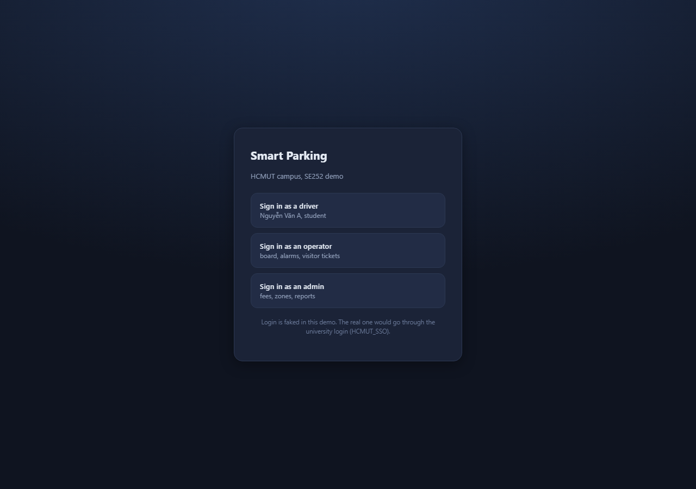
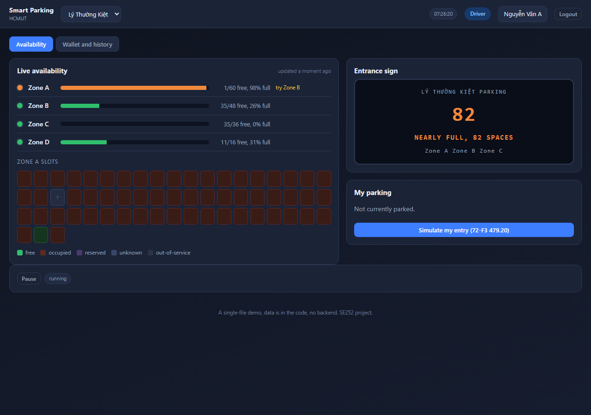
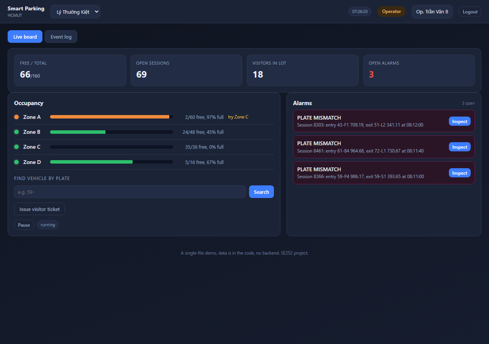
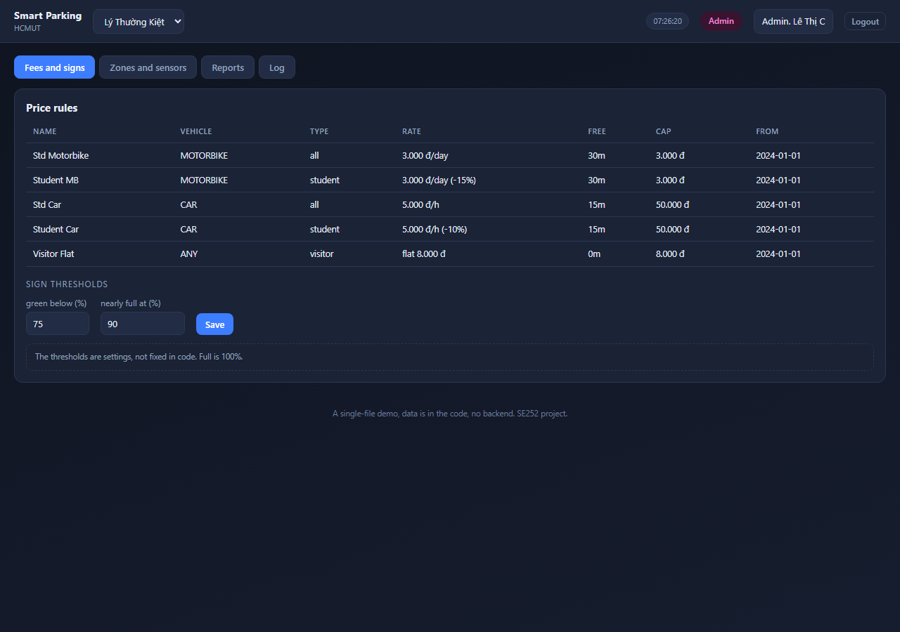

# SmartParking (IoT-SPMS)

A smart parking system for a university campus (HCMUT), done for the Software Engineering course (SE252).

It tracks which slots are free using sensors, handles entry and exit, shows how full each area is on the gate signs, works out and collects the parking fee, and gives the operators and admins a live view plus a record of what happened. The design is built around the fact that campus parking here is mostly motorbikes and everyone arrives in a rush before class, which is a bit different from a normal car park.

## Demo

Open [`mvp/index.html`](mvp/index.html) in a browser. There is nothing to install and it does not need the internet. It also runs on GitHub Pages once that is turned on (Settings, then Pages, deploy from `main`, then open `/mvp/`).

On the login screen pick a role: driver, operator, or admin. The demo keeps running on its own: vehicles come and go, sensors sometimes drop out, a theft alarm fires when a plate does not match, and payments go through.

| Login | Driver | Operator | Admin |
|---|---|---|---|
|  |  |  |  |

## What is in here

```
docs/
  01-requirements.md   context, stakeholders, requirements, use-case diagram
  02-uml-and-ui.md     scenarios, sequence/activity/state diagrams, UI
  03-design.md         architecture, deployment, class diagram, methods, tests
  pdf/                 the three parts as PDF
mvp/
  index.html           the demo (UI and styles)
  app.js               the state, the simulation, and the screens
assets/                the screenshots above
```

The Markdown files show fine on GitHub, diagrams included. The PDFs are the version we hand in.

## Main design choices

These are the decisions the rest follows from:

- The main lane is barrier-free. A barrier is too slow for the morning rush, so a camera reads the plate and the rider taps the card while moving. Barriers are only for the smaller car lot.
- A plate is tied to the card. We store the plate at entry and read it again at exit. If it does not match, we treat it as a possible theft and raise an alarm.
- The free count stays close to live and copes with faults. Sensors send changes over MQTT, and a sensor that goes quiet is marked unknown and not counted as free.
- Login goes through HCMUT_SSO, which is a CAS server (we assumed this from the login page), and student data is read from DATACORE without writing back.
- BKPay is stubbed. The real one is a web portal with no API we could use for parking, so we mock it and note a real hookup as future work.
- The backend is one app with the parts kept separate, which a small team can build but which could be split later.

## How it is built

Plain HTML, CSS, and JavaScript, no libraries, with the data written into the code. The course said a backend or database is not required, so there is not one.

## AI use

See [`AI-USAGE.md`](AI-USAGE.md) for how we used AI on this.
