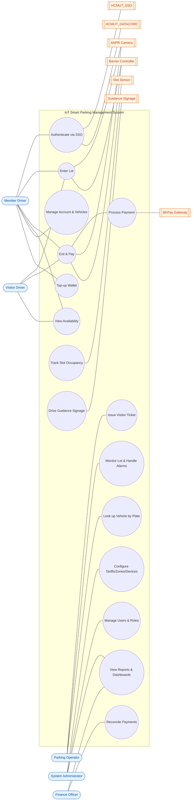

# IoT-based Smart Parking Management System (IoT-SPMS)
## Submission #1 — Requirements Specification

**Course:** Software Engineering (SE252)
**Project:** Smart Parking System for University Campus — Ho Chi Minh City University of Technology (HCMUT)
**Document status:** Requirements baseline v1.0

---

## Table of Contents
1. [Project Context & Overview](#1-project-context--overview)
2. [Stakeholders](#2-stakeholders)
3. [Objectives & Scope](#3-objectives--scope)
4. [Actors](#4-actors)
5. [Functional Requirements](#5-functional-requirements)
6. [Use-Case Diagram](#6-use-case-diagram)
7. [Non-Functional Requirements](#7-non-functional-requirements)
8. [Assumptions, Constraints & Open Questions](#8-assumptions-constraints--open-questions)
9. [Glossary](#9-glossary)

---

## 1. Project Context & Overview

### 1.1 Background
Ho Chi Minh City University of Technology (HCMUT), a member of Vietnam National University – HCMC, operates across two campuses — **Cơ sở 1** at 268 Lý Thường Kiệt (District 10) and **Cơ sở 2** in Dĩ An, Bình Dương — serving approximately **23,000 undergraduates, 2,100 master's students, and 300 doctoral candidates**, plus faculty, staff, and external visitors. This population generates a very large volume of daily parking activity.

The university already runs an **RFID parking-card scheme** (introduced May 2019) for motorbikes and bicycles. That incumbent system, and campus parking generally, faces four concrete pain points:

- **Peak-hour congestion.** Nearly all students arrive on motorbikes in tight pre-class windows (before ~07:00 and ~12:30), producing hundreds of arrivals per minute at each gate. Per-vehicle barrier gates physically cannot keep up.
- **Card loss and counterfeiting**, with weak binding between the card and the actual vehicle.
- **Manual cash handling and manual reconciliation** by guards.
- **No real-time visibility** of where spaces are free, leading to wasted search time inside lots.

### 1.2 The proposed system
The **IoT-based Smart Parking Management System (IoT-SPMS)** modernises campus parking by:

- Linking every parking transaction to the driver's **real HCMUT identity** via the university Single Sign-On (**HCMUT_SSO**).
- Detecting per-slot occupancy through **IoT sensors** and computing a **near-real-time** view of availability.
- Driving **electronic guidance signage** (available / nearly-full / full) at entrances and key intersections.
- Automating **fee computation and payment** through the university payment platform (**BKPay**) for members, with cash/QR handling for visitors.
- Giving operators and administrators **live visibility, configuration, and full audit** of all parking and financial activity.

### 1.3 Domain reality that shapes the requirements
Two facts distinguish this from a Western car-parking product and drive design decisions throughout this document:

1. **Motorbike dominance.** In Vietnam ~89% of households own a motorbike versus ~9% a car, and motorbikes are 85–90% of road traffic. On campus the primary vehicle class is the **motorbike (xe máy)**, parked in a dense ~1 m × 2 m footprint, with cars a small minority handled in a separate lane. The system's primary flow is therefore designed for **high-throughput motorbike traffic**, not one-car-per-bay barrier stalls.

2. **Burst throughput is the defining constraint.** Because a per-vehicle barrier has a ~1.5 s open/close cycle (≈40 vehicles/min ceiling per lane), it gridlocks against peak demand. The system is designed for **barrier-free, multi-lane flow**: an overhead ANPR camera plus a contactless RFID/NFC card tap recorded on the move, with plate-versus-card reconciliation at exit. Physical barriers are reserved for the smaller car lot and paid-exit reconciliation.

A **core anti-theft rule** follows from (1)–(2): identity is **plate-bound, not merely card-bound**. On entry the system records the card/account, the ANPR-read plate, an entry photo, and a timestamp; on exit it re-reads the plate for the same card and **raises an anti-theft alarm on any mismatch** (a stolen bike presents a card that does not match its plate). This rule is reflected in the requirements below (FR-EXT-04) and in the data model.

---

## 2. Stakeholders

| # | Stakeholder | Interest / Expectation | Influence |
|---|---|---|---|
| S1 | **Drivers who are members** (students, faculty, staff) | Fast, frictionless entry/exit; fair and transparent fees; ability to see free spaces before entering; self-service account and payment. | High (primary users, largest group) |
| S2 | **Visitor drivers** | Simple guest access without a campus account; clear payment at exit. | Medium |
| S3 | **Parking operators / attendants** | Reliable live occupancy board; fast vehicle lookup; tools to handle exceptions (stuck barrier, lost ticket, alarms) and take cash. | High (day-to-day operation) |
| S4 | **System administrators** | Configurable tariffs, zones, sensors, and roles; dashboards; exportable reports; complete audit trail. | High (own the system config) |
| S5 | **University finance department** | Correct fee computation; reconciled revenue against the bank (OCB) settlement; auditable financial records. | High |
| S6 | **Facilities & campus security** | Barrier safety; anti-theft protection; equipment reliability. | Medium |
| S7 | **HCMUT IT / SSO administrators** | Correct, secure integration with HCMUT_SSO (CAS) and read-only integration with HCMUT_DATACORE; attribute-release governance. | High (gatekeepers of integration) |
| S8 | **University management** | Reduced congestion, better space utilisation, modern student experience, cost control. | High (project sponsor) |
| S9 | **SE252 course graders** | A correct, realistic, well-structured engineering deliverable. | (Academic) |

---

## 3. Objectives & Scope

### 3.1 Objectives
- **O1 — Automate access control.** Record entry/exit automatically for members via SSO-linked identity and for visitors via a temporary-access mechanism, without a centralized-authentication dependency at the gate.
- **O2 — Provide near-real-time availability.** Maintain and publish a per-zone free-space count that is resilient to sensor and network faults.
- **O3 — Guide traffic.** Drive dynamic signage (available / nearly-full / full) and directional guidance to reduce in-lot search and gate congestion.
- **O4 — Integrate billing & payment.** Accumulate learner activity over a billing period, compute fees per configurable policy, and initiate payment through BKPay; support cash/QR for visitors.
- **O5 — Enforce roles & auditability.** Apply role-based access control across end users, operators, and administrators, and log all parking and financial activity immutably.
- **O6 — Operate reliably under real-world constraints:** high concurrency, intermittent connectivity, and heterogeneous user groups.

### 3.2 In scope
Access control (entry/exit), IoT slot-occupancy tracking and reconciliation, guidance signage, availability API/app, session and billing management, BKPay/cash payment, visitor ticketing, SSO authentication, read-only DATACORE synchronization, RBAC, administration/configuration, dashboards/reporting, and audit logging.

### 3.3 Out of scope (this project)
Physical procurement/installation of sensors and barriers; the internal implementation of HCMUT_SSO, HCMUT_DATACORE, and BKPay (treated as external systems); enforcement/towing of illegally parked vehicles; navigation *outside* the campus.

### 3.4 Scope decisions for the MVP
- **Reservation** (FR group E) is treated as **optional/bonus**.
- **BKPay** is integrated at the **design level** and **stubbed/mocked** in the prototype, because the real BKPay is web-only, bank-locked (OCB), and exposes no public parking API (see §8).
- The prototype demonstrates a **single representative lot**, but the model and configuration support **multi-campus, multi-gate**.

---

## 4. Actors

Actors are separated on two axes so they are not conflated: the **application role** (what functions you may invoke — an RBAC concern) and, for end users, the **affiliation** (student / faculty / staff / visitor — an attribute that drives *pricing and eligibility*, not screens).

### 4.1 Primary (human) actors
| Actor | Application role | Description & main goals |
|---|---|---|
| **Member Driver** | `end_user` | Student, faculty, or staff with an HCMUT identity. Authenticates via SSO-linked account, views availability, enters/exits, is billed automatically, tops up a prepaid balance, and manages own account, vehicles, and history. |
| **Visitor Driver** | `end_user` (`affiliation = visitor`) | External person with **no campus account**. Handled through an operator-created, plate-only/ticket session; pays at exit by cash or QR. |
| **Parking Operator** | `operator` | Monitors the live occupancy board, handles exceptions and alarms, issues visitor tickets, looks up vehicles by plate, and accepts cash. Scoped to assigned lot(s). |
| **System Administrator** | `admin` | Configures tariffs, zones, slots, sensors, devices, and roles; manages users and blacklist; views dashboards, reports, and the audit log; runs reconciliation. |
| **Finance Officer** | `finance` (optional split of admin) | Views financial reports and reconciliation breaks; authorises refunds/waivers. |

### 4.2 Secondary (external-system) actors
These participate in use cases and appear on the use-case diagram:

- **Slot Occupancy Sensor** — reports a slot as occupied/vacant.
- **Barrier Controller** — receives open/close commands (car lane / paid exit).
- **RFID/NFC Card Reader** — reads the member card.
- **ANPR Camera** — reads the licence plate.
- **Guidance Signage** — displays availability state and directions.
- **HCMUT_SSO** — the university Central Authentication Service (CAS).
- **HCMUT_DATACORE** — read-only system of record for identity/vehicle data.
- **BKPay Payment Gateway** — processes member/online payments (via OCB).

---

## 5. Functional Requirements

Requirements are grouped into seven modules. Each is atomic and verifiable, uniquely identified, and phrased as *"The system shall…"*. Priorities use **MoSCoW** (M = Must, S = Should, C = Could). Each requirement is traceable to a use case (see §6).

### Module A — Entry / Access Control

| ID | Priority | Requirement |
|---|---|---|
| FR-ENT-01 | M | The system shall detect a vehicle approaching an entry lane and trigger credential capture. |
| FR-ENT-02 | M | The system shall read a member's RFID/NFC card or QR code and read the vehicle's licence plate via the ANPR camera at entry. |
| FR-ENT-03 | M | The system shall validate the presented credential against active membership, the blacklist, and the lot-full condition before granting entry. |
| FR-ENT-04 | M | The system shall, when a valid member credential is present, create an **active parking session** recording {timestamp, lane, card/account ID, plate, entry photo}. |
| FR-ENT-05 | M | The system shall, when no member credential is present, initiate the **visitor/temporary-access flow**: issue a parking ticket (QR) and open a plate-only session managed independently of HCMUT_SSO. |
| FR-ENT-06 | M | The system shall deny entry and display a reason when the lot/zone is full, the credential is invalid, or the vehicle/plate is blacklisted. |
| FR-ENT-07 | S | The system shall, for the car lane, command the entry barrier to open on a granted decision and record the barrier action. |
| FR-ENT-08 | M | The system shall keep recording entry/exit during a backend or network outage using locally cached decisions, and queue the events for synchronization on reconnect (see NFR-REL-02). |

### Module B — Slot Occupancy & Detection

| ID | Priority | Requirement |
|---|---|---|
| FR-OCC-01 | M | The system shall receive per-slot occupancy state changes (occupied ↔ vacant) reported by slot sensors. |
| FR-OCC-02 | M | The system shall maintain an authoritative current state for every slot: FREE, OCCUPIED, RESERVED, or OUT_OF_SERVICE. |
| FR-OCC-03 | M | The system shall aggregate a **free-space count** per zone and per lot from slot state and gate entry/exit counts. |
| FR-OCC-04 | M | The system shall reconcile the sensor-derived state against gate entry/exit counts on a periodic schedule and flag discrepancies. |
| FR-OCC-05 | M | The system shall mark a slot/sensor whose state is older than the staleness timeout as **"unknown"** and shall never count an unknown slot as free (see NFR-REL-03). |
| FR-OCC-06 | S | The system shall detect and flag a stuck or faulty sensor and raise a maintenance alert. |
| FR-OCC-07 | S | The system shall perform a nightly zero/recalibration of count-based occupancy when a lot empties, to counter count drift. |

### Module C — Guidance & Signage

| ID | Priority | Requirement |
|---|---|---|
| FR-SIG-01 | M | The system shall compute an availability state per zone from the free-space count and configurable thresholds. |
| FR-SIG-02 | M | The system shall drive an entrance sign showing the lot state (e.g. `xx SPACES` / `NEARLY FULL` / `FULL`). |
| FR-SIG-03 | S | The system shall drive zone/level signs and in-aisle directional guidance pointing toward the adjacent zone with the greatest free count; when a zone is full it shall direct drivers to the nearest non-full zone. |
| FR-SIG-04 | M | The system shall allow administrators to configure the occupancy-percentage thresholds that map to each sign state (default: green < 75 %, yellow 75–89 %, orange/nearly-full 90–99 %, red/full 100 %). |
| FR-SIG-05 | M | The system shall publish the current availability to a web/mobile view, timestamping each figure. |

### Module D — Exit / Billing

| ID | Priority | Requirement |
|---|---|---|
| FR-EXT-01 | M | The system shall read the member card (or ticket QR) and re-read the licence plate at exit. |
| FR-EXT-02 | M | The system shall locate the matching active session for the presented credential. |
| FR-EXT-03 | M | The system shall compute the parking fee from session duration and the applicable **pricing policy** (vehicle type, affiliation tier, active pass), applying the configured rounding and daily-cap rules. |
| FR-EXT-04 | M | The system shall compare the entry plate against the exit plate and **raise an anti-theft alarm** on mismatch, holding the session for operator resolution. |
| FR-EXT-05 | M | The system shall process payment for the computed fee via prepaid wallet balance, BKPay, or operator-accepted cash, and close the session on success. |
| FR-EXT-06 | M | The system shall freeze the computed amount and the pricing-rule version onto the billing record at session close, so later rate changes never rewrite historical bills. |
| FR-EXT-07 | S | The system shall, for the car lane, command the exit barrier to open only after payment is settled or a valid pass is confirmed. |
| FR-EXT-08 | M | The system shall accumulate member charges over the configured billing period and generate a period statement, initiating a BKPay payment request for the balance. |

### Module E — Reservation *(optional / bonus)*

| ID | Priority | Requirement |
|---|---|---|
| FR-RES-01 | C | The system shall let a member search availability and reserve a slot for a time window. |
| FR-RES-02 | C | The system shall hold a reserved slot and auto-release it after a configurable no-show timeout. |
| FR-RES-03 | C | The system shall convert a reservation into an active session when the member enters within the window. |

### Module F — Administration & Reporting

| ID | Priority | Requirement |
|---|---|---|
| FR-ADM-01 | M | The system shall let administrators create, update, version, and deactivate **pricing policies/tariffs** with `valid-from`/`valid-to` dates. |
| FR-ADM-02 | M | The system shall let administrators manage users, cards, vehicles, the blacklist, and role assignments. |
| FR-ADM-03 | M | The system shall let administrators configure zones, slots, sensors, gateways, signage, and the device registry. |
| FR-ADM-04 | M | The system shall present dashboards for occupancy, revenue, and peak-hour analysis. |
| FR-ADM-05 | S | The system shall export parking and financial reports for a selected period. |
| FR-ADM-06 | M | The system shall run a periodic **reconciliation** of local settled payments against the bank/BKPay settlement report and record unmatched items as reconciliation breaks. |

### Module G — Monitoring & Audit

| ID | Priority | Requirement |
|---|---|---|
| FR-AUD-01 | M | The system shall present operators a **live lot-status board** of current occupancy, active sessions, and open alarms. |
| FR-AUD-02 | M | The system shall let an operator look up any active session or vehicle by plate. |
| FR-AUD-03 | M | The system shall raise alarms for hardware faults, forced barriers, plate mismatch, and anti-passback (double-entry) violations, and let operators acknowledge them. |
| FR-AUD-04 | M | The system shall write an **immutable, tamper-evident audit record** for every entry, exit, payment, and privileged administrative action, capturing actor, timestamp, and before/after state. |

### 5.1 Requirement → Use-case traceability (summary)
| Use case | Requirements covered |
|---|---|
| Enter Lot (Member) | FR-ENT-01..04, FR-ENT-07, FR-OCC-03 |
| Enter Lot (Visitor) | FR-ENT-01, FR-ENT-05, FR-ENT-06 |
| Exit & Pay | FR-EXT-01..08, FR-AUD-04 |
| View Availability | FR-OCC-03, FR-SIG-01, FR-SIG-05 |
| Drive Signage | FR-SIG-01..04 |
| Track Occupancy | FR-OCC-01..07 |
| Monitor & Handle Alarms | FR-AUD-01..03, FR-EXT-04 |
| Configure System | FR-ADM-01..03, FR-SIG-04 |
| Reporting & Reconciliation | FR-ADM-04..06, FR-AUD-04 |
| Authenticate (SSO) | (cross-cutting; supports all end-user use cases) |

---

## 6. Use-Case Diagram

> Rendered with Mermaid. Members and visitors are both `end_user`; visitor sessions are created via the operator. External systems appear as secondary actors on the right.



**Relationship notes (for the tabular UML in the PDF):**
- **Enter Lot** `«include»` **Track Slot Occupancy** (availability check) and `«include»` capture via ANPR.
- **Exit & Pay** `«include»` **Process Payment**; `«extend»` *Anti-theft alarm on plate mismatch* (FR-EXT-04).
- **Enter Lot** `«extend»` *Issue Visitor Ticket* (when no member credential — FR-ENT-05).
- **Authenticate via SSO** is `«include»`d by all member-initiated use cases.
- **View Reports & Dashboards** generalises to Finance and Admin.

---

## 7. Non-Functional Requirements

Classified by **ISO/IEC 25010:2023** product-quality characteristics. Each states a **measurable target the team will validate** (not a measured result) with a verification method. Priority order for this domain: (1) offline/availability, (2) sensor fault tolerance, (3) latency, (4) concurrency, (5) security/privacy, (6) auditability, (7) scalability, (8) usability, (9) safety.

| ID | 25010 characteristic | Requirement | Metric / target | Condition / load | Verification |
|---|---|---|---|---|---|
| NFR-PERF-01 | Performance efficiency (time behaviour) | Barrier-open latency from a valid card read to the open command. | **≤ 2 s (p95), ≤ 3 s (p99)** | Nominal load | Load test with timing logs |
| NFR-PERF-02 | Performance efficiency | Availability view and signage reflect a slot state change. | **≤ 5 s** | Near-real-time | Instrumented end-to-end test |
| NFR-PERF-03 | Performance efficiency | Core API response time. | **p99 ≤ 500 ms** | Nominal | Load test |
| NFR-PERF-04 | Performance efficiency | ANPR plate recognition. | **< 2 s, ≥ 98 % accuracy** | Daylight, standard plates | Sample dataset test |
| NFR-CAP-01 | Performance efficiency (capacity) | Concurrent lane events / active sessions / sensor ingest without degradation. | **≥ 20 lane events; ≥ 2,000 active sessions; ≥ 500 msg/s ingest** | Peak | Stress test |
| NFR-REL-01 | Reliability (availability) | System uptime. | **≥ 99.5 % monthly** (≤ ~3.6 h/month) | Rolling month | Uptime monitoring |
| NFR-REL-02 | Reliability (offline operation) | Entry/exit continues during a backend/network outage; queued events sync on reconnect. | Local decisions cached; **sync ≤ 60 s** of reconnect | Backhaul outage | Fault-injection test |
| NFR-REL-03 | Reliability (fault tolerance) | A single failed sensor must not corrupt the free-count; slot degrades to "unknown" and is alerted. | **Alert ≤ 30 s**; count never negative | Sensor failure | Fault-injection test |
| NFR-REL-04 | Reliability (recoverability) | Recover the last consistent state after power/crash; open sessions preserved. | **RTO ≤ 2 min, RPO ≤ 30 s** | Crash/power loss | Recovery test |
| NFR-SEC-01 | Security (confidentiality) | Card IDs and payment data encrypted at rest and in transit; no full card/payment data in logs. | **AES-256 at rest, TLS 1.2+ in transit** | Always | Config review, pen-test |
| NFR-SEC-02 | Security (integrity/authorization) | Every privileged operation is authorized by RBAC and object-level checks. | 0 unauthorized actions in test suite | Always | Authorization test |
| NFR-SEC-03 | Security (accountability) | 100 % of entry/exit/payment/admin events logged, immutable, retained ≥ 12 months, queryable. | **100 % coverage; retention ≥ 12 mo** | Always | Audit-log review |
| NFR-SEC-04 | Security (non-repudiation) | Detect anti-passback, clone-card, and plate-mismatch conditions. | Alarm raised on each condition | Always | Scenario test |
| NFR-SCAL-01 | Performance efficiency (scalability) | Scale from a 200-slot lot to ≥ 5,000 slots / multiple sites with no redesign; adding a lot is configuration only. | **≥ 5,000 slots**, config-only | Growth | Architecture review + config test |
| NFR-USE-01 | Interaction capability (usability) | Entrance sign readable at distance; first-time driver interprets indicators; operator finds a vehicle fast. | **Readable ≥ 30 m daylight; ≥ 95 % interpret unaided; find-by-plate ≤ 15 s** | Field | Usability test |
| NFR-SAFE-01 | Safety | The barrier must be **fail-safe**: it shall not close on a vehicle or person and shall warn on hazard. | 0 unsafe closures | Vehicle/person present | Safety test / interlock review |
| NFR-MAINT-01 | Maintainability / Flexibility | Services are modular and independently deployable; a sensor vendor is replaceable behind an abstraction. | Sensor swap = adapter change only | Change request | Code review |
| NFR-COMP-01 | Compatibility | Integrate with HCMUT_SSO (CAS), read-only HCMUT_DATACORE, and BKPay via standard protocols. | Conforms to each external interface | Integration | Integration test |

---

## 8. Assumptions, Constraints & Open Questions

### 8.1 Key assumptions (explicitly stated)
1. **HCMUT_SSO is a CAS server** (Apereo/Jasig CAS, self-reported v3.5.1), not OAuth2/OIDC. The system integrates as a CAS *service* (redirect → service ticket → `/p3/serviceValidate`) using a CAS client library. If graders permit an abstract identity provider, it may be modelled as OIDC.
2. **HCMUT_DATACORE is the read-only system of record.** The system provisions a local user record on first login from SSO attributes, then enriches/refreshes from DATACORE via on-demand cache with a TTL (≈24 h for profile). The local copy is a cache; the system **never writes** to DATACORE.
3. **BKPay has no public parking API** — it is web-only, single-bank (OCB), and tuition/service-fee scoped. For the prototype the payment gateway is **stubbed**, designed to the standard Vietnamese-gateway shape (redirect + server-to-server IPN, HMAC-signed, idempotent). A real BKPay/OCB integration is future work.
4. **Primary vehicle is the motorbike**, handled in barrier-free multi-lane flow with ANPR + card tap; barriers apply to the car lane only.
5. **Occupancy is count-based per zone** (increment on entry, decrement on exit) with nightly recalibration to counter drift.
6. The prototype demonstrates one representative lot; the model supports multi-campus, multi-gate.

### 8.2 Constraints
- Must integrate with existing HCMUT_SSO, HCMUT_DATACORE, and BKPay.
- Must enforce role-based access control (end user, operator, administrator).
- Must operate under intermittent connectivity and high concurrency.
- All parking and financial activity must be logged for audit.

### 8.3 Open questions (to confirm with stakeholders)
1. **Which user attributes does `/p3/serviceValidate` release** for a parking service (uid, email, name, **affiliation/role**, faculty)? This decides how much DATACORE data is actually needed.
2. Does DATACORE expose a query API (for on-demand caching) or only batch export? Does it hold vehicle/plate registration?
3. Does any BKPay/OCB micropayment or webhook API exist, or must parking use the "service fee" rail? Is a prepaid wallet acceptable to finance?
4. Will the university grant a CAS service registration and service URL, and what is the single-logout behaviour?
5. Barrier safety-certification requirements (fail-safe on vehicle presence).
6. Is Reservation (Module E) in scope for the first release?

---

## 9. Glossary

| Term | Meaning |
|---|---|
| **ANPR / LPR** | Automatic Number-Plate Recognition — camera-based reading of the licence plate. |
| **CAS** | Central Authentication Service — the SSO protocol HCMUT_SSO uses (ticket-based). |
| **BKNetID / MSSV** | HCMUT network account / student ID used to log in via SSO. |
| **BKPay** | HCMUT's internal payment platform (bank rail: OCB). |
| **DATACORE** | HCMUT_DATACORE — read-only master data for identity and vehicle registration. |
| **RBAC / ABAC** | Role-Based / Attribute-Based Access Control. |
| **MQTT** | Lightweight publish/subscribe messaging protocol used between IoT gateways and the backend. |
| **IPN** | Instant Payment Notification — the gateway's server-to-server payment callback (source of truth for settlement). |
| **Anti-passback** | A rule preventing the same credential/vehicle from entering twice without an intervening exit. |
| **Session** | A `ParkingSession` — one park event from entry to exit, the unit of billing. |
| **Staleness timeout** | The age after which a slot's last-known state is downgraded to "unknown". |
```
