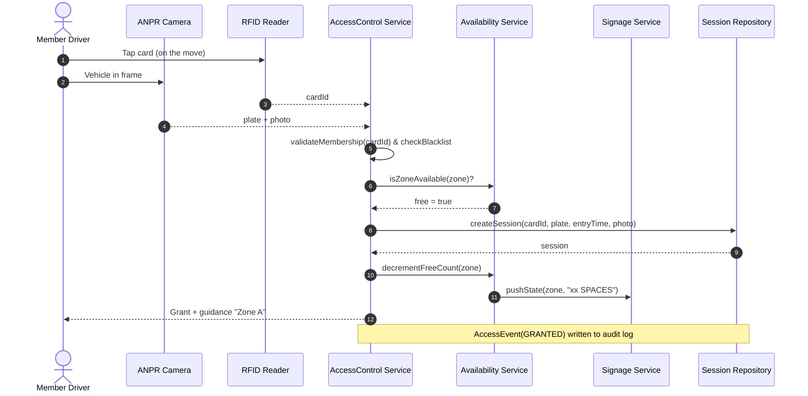
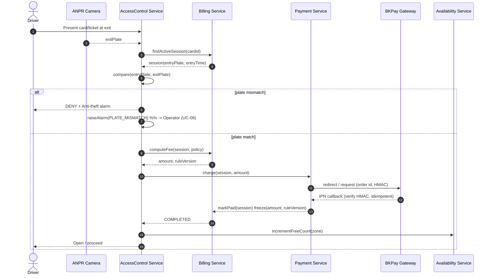
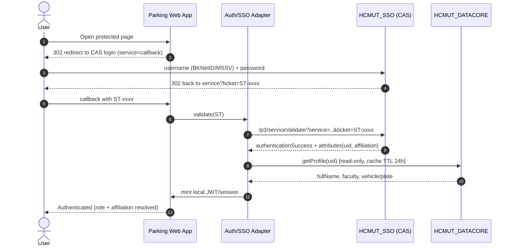
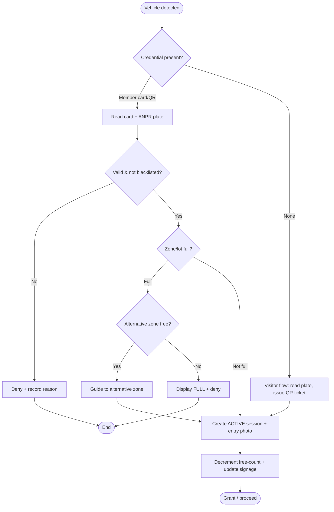
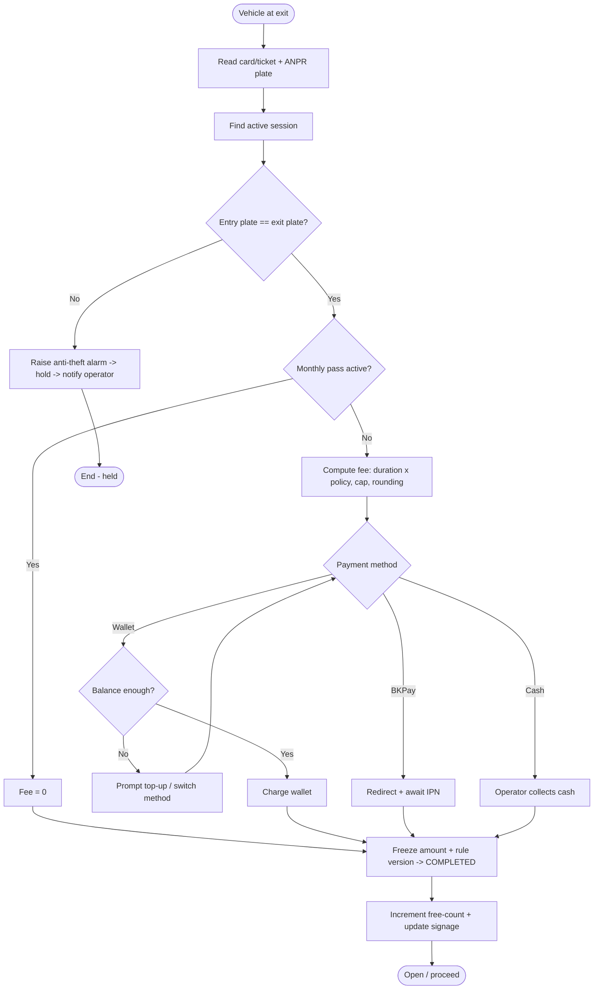
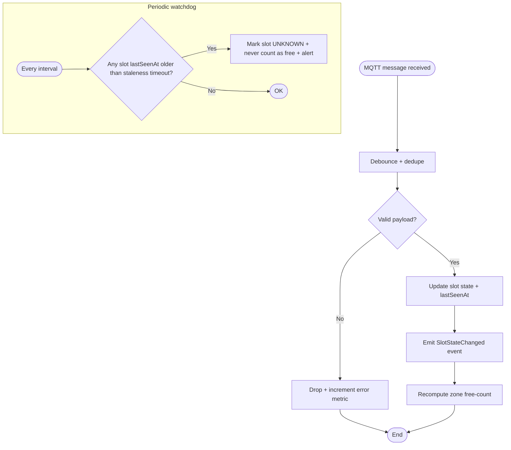
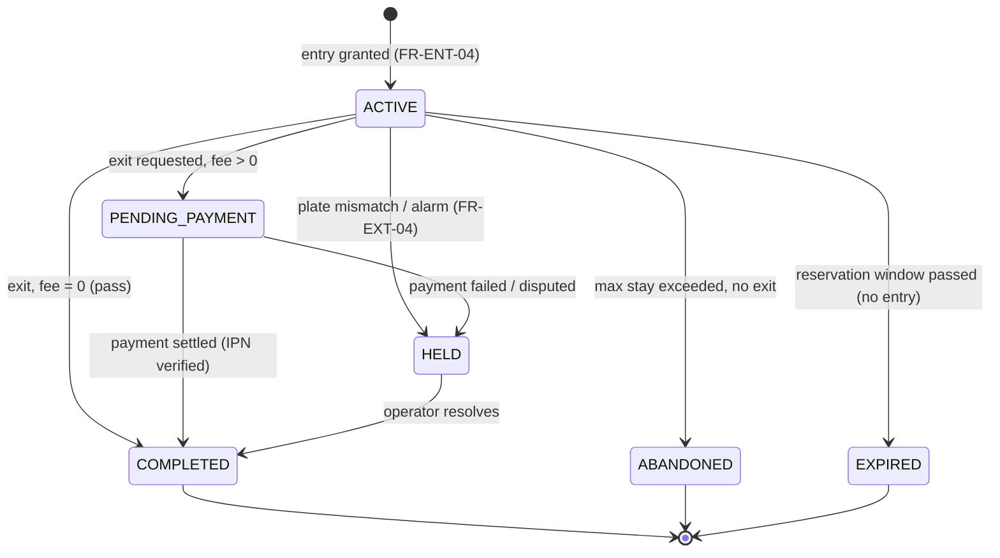
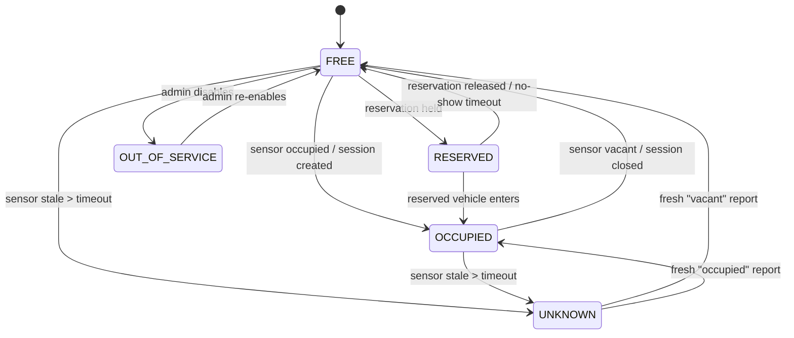
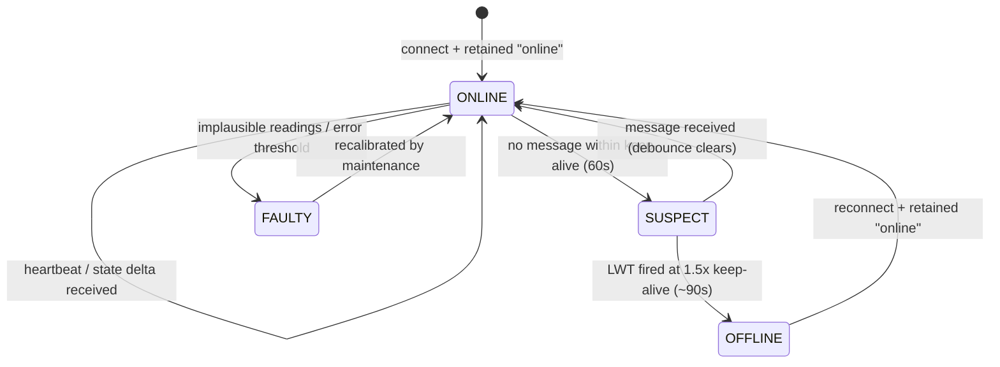
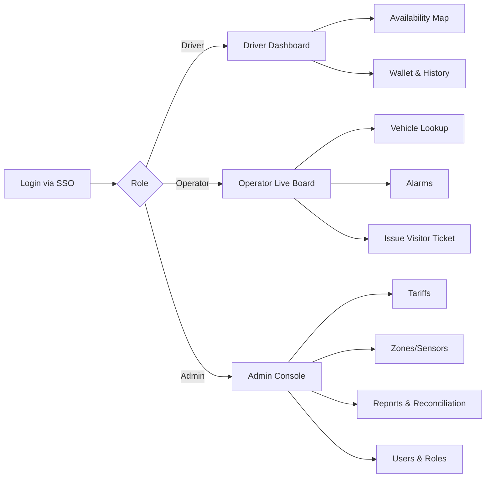

# IoT-based Smart Parking Management System (IoT-SPMS)
## Submission #2 — Use-Case Scenarios, Dynamic Diagrams & UI Design

**Course:** Software Engineering (SE252)
**Project:** Smart Parking System for University Campus — HCMUT
**Document status:** v1.0 (builds on the Requirements baseline, Submission #1)

---

## Table of Contents
1. [Use-Case Scenarios](#1-use-case-scenarios)
2. [Sequence Diagrams](#2-sequence-diagrams)
3. [Activity Diagrams](#3-activity-diagrams)
4. [State-chart Diagrams](#4-state-chart-diagrams)
5. [UI Design — Mockups & Screen Flow](#5-ui-design--mockups--screen-flow)

---

## 1. Use-Case Scenarios

Scenarios use the standard fully-dressed tabular format (Cockburn style): main success scenario plus extensions/alternate flows. IDs link back to functional requirements in Submission #1.

### UC-02 — Enter Lot (Member, motorbike lane)

| Field | Content |
|---|---|
| **Use case** | Enter Lot (Member) |
| **Actors** | Member Driver (primary); ANPR Camera, RFID/NFC Reader, Slot Sensor, Guidance Signage (secondary) |
| **Stakeholders** | Member (fast entry), University (throughput, anti-theft), Operator (fewer exceptions) |
| **Preconditions** | Member has an active HCMUT identity and a registered card/plate; the entry lane is operational. |
| **Trigger** | A vehicle is detected approaching the entry lane (FR-ENT-01). |
| **Postcondition (success)** | An **ACTIVE ParkingSession** exists recording {entry time, lane, card ID, plate, photo}; the zone free-count is decremented; the entry is logged. |
| **Related requirements** | FR-ENT-01..04, FR-ENT-07, FR-OCC-03, FR-AUD-04 |

**Main success scenario**
1. The vehicle approaches; the system detects it and triggers credential capture.
2. The RFID/NFC reader reads the member card; the ANPR camera reads the plate and captures a photo.
3. The system validates the card against active membership and the blacklist.
4. The system checks that the target zone is not full.
5. The system verifies the read plate is a registered plate for that member (or records it if first-seen and policy allows).
6. The system creates an ACTIVE ParkingSession and records the AccessEvent (decision = GRANTED).
7. The system decrements the zone free-count and updates guidance signage.
8. (Car lane only) The system commands the entry barrier to open.
9. The system displays/announces a "welcome, proceed to Zone X" guidance.

**Extensions / alternate flows**
- **3a. Card invalid or blacklisted:** deny entry, record AccessEvent (DENIED, reason), show reason; end.
- **4a. Zone/lot full:** the system directs the driver to an alternative zone (FR-SIG-03); if the whole lot is full, deny and display FULL (FR-ENT-06).
- **2a. No card presented (visitor or forgotten card):** trigger **UC-02b Enter Lot (Visitor)**.
- **5a. Plate not registered to this member:** flag for operator review but allow entry (grace), noting the discrepancy for exit reconciliation.
- **\*a. Backend/network outage:** the gate makes a locally cached decision and queues the event for sync within 60 s (FR-ENT-08).

### UC-02b — Enter Lot (Visitor / temporary access)

| Field | Content |
|---|---|
| **Actors** | Visitor Driver (primary); Parking Operator, ANPR Camera |
| **Preconditions** | Visitor has no campus account; visitor capacity available. |
| **Trigger** | No member credential is presented at the lane, or a member requests temporary access without a card. |
| **Postcondition** | A **plate-only session** is open and a QR ticket is issued (FR-ENT-05). |

**Main success scenario**
1. The system (or operator) detects no valid member credential.
2. The ANPR camera reads and stores the plate; an entry photo is captured.
3. The system issues a QR parking ticket and opens a plate-only ParkingSession managed independently of HCMUT_SSO.
4. The system records the AccessEvent and updates the free-count.

**Extensions**
- **2a. Plate unreadable:** the operator enters the plate manually; continue.
- **3a. Visitor capacity full:** deny and inform; end.

### UC-03 — Exit & Pay

| Field | Content |
|---|---|
| **Use case** | Exit & Pay |
| **Actors** | Member/Visitor Driver (primary); ANPR Camera, RFID Reader, BKPay Gateway, Barrier Controller, Operator (exception) |
| **Preconditions** | An ACTIVE session exists for the vehicle. |
| **Trigger** | The vehicle presents at an exit lane. |
| **Postcondition (success)** | The session is COMPLETED, a paid BillingRecord exists, the free-count is incremented, and the exit is logged. |
| **Related requirements** | FR-EXT-01..08, FR-AUD-04 |

**Main success scenario**
1. The system reads the card/ticket and re-reads the plate at exit.
2. The system locates the matching ACTIVE session.
3. The system **compares the entry plate to the exit plate**.
4. The system computes the fee from duration and the applicable pricing policy (rounding + daily cap).
5. The system charges the prepaid wallet, or redirects to BKPay, or the operator accepts cash.
6. On payment success, the system **freezes the amount and rule version** onto the BillingRecord and marks the session COMPLETED.
7. The system increments the zone free-count and updates signage.
8. (Car lane) The system commands the exit barrier to open.

**Extensions / alternate flows**
- **3a. Plate mismatch (entry ≠ exit):** raise **anti-theft alarm** (FR-EXT-04); hold the session PENDING_PAYMENT/held; notify the operator (UC-08); block barrier; end until resolved.
- **2a. No active session found (lost ticket):** operator opens a lost-ticket exception, charges a lost-ticket fee, and creates a manual close.
- **5a. Insufficient wallet balance:** offer top-up or BKPay redirect or cash.
- **5b. BKPay IPN not received:** the session stays PENDING_PAYMENT; the reconciliation job (FR-ADM-06) resolves it; the operator may manually confirm on evidence.
- **5c. Member on monthly pass:** fee = 0; skip payment, close session.

### UC-08 — Monitor Lot & Handle Alarms

| Field | Content |
|---|---|
| **Actors** | Parking Operator (primary) |
| **Preconditions** | Operator authenticated with `operator` role, scoped to the lot. |
| **Trigger** | An alarm is raised, or the operator opens the live board. |
| **Postcondition** | The alarm is acknowledged/resolved and the action is audited. |

**Main success scenario**
1. The operator views the live lot board (occupancy, active sessions, open alarms).
2. An alarm appears (plate mismatch / stuck barrier / faulty sensor / double-entry).
3. The operator inspects the related session/vehicle (look-up by plate, FR-AUD-02).
4. The operator takes an action (manual open, hold, mark resolved, escalate).
5. The system records the action in the audit log (FR-AUD-04).

### UC-12 — Configure Tariffs / Zones / Devices (Admin)

| Field | Content |
|---|---|
| **Actors** | System Administrator |
| **Preconditions** | Authenticated with `admin` role. |
| **Postcondition** | New configuration is versioned and active; the change is audited. |

**Main success scenario**
1. The admin opens configuration (tariffs, zones, slots, sensors, signage thresholds).
2. The admin edits a pricing policy, setting `valid-from`/`valid-to`.
3. The system validates the change (no overlapping active rules for the same class).
4. The system versions and activates the change and records it in the audit log.

**Extensions**
- **3a. Overlapping rule:** reject with an explanatory message; no change.

---

## 2. Sequence Diagrams

### SD-1 — Member entry (motorbike lane, barrier-free)



### SD-2 — Exit & pay with plate-match check + BKPay



### SD-3 — Sensor state change → availability → signage (IoT path with resilience)

```mermaid
sequenceDiagram
    autonumber
    participant Sensor as Slot Sensor
    participant GW as IoT Gateway
    participant Broker as MQTT Broker
    participant Ingest as Sensor Ingestion
    participant Avail as Availability Service
    participant Sign as Signage Service

    Sensor->>GW: state delta (occupied/vacant)
    GW->>Broker: publish parking/lot/zone/slot/state (QoS1, retained)
    Broker->>Ingest: deliver message
    Ingest->>Ingest: debounce + dedupe + validate
    Ingest->>Avail: SlotStateChanged(slotId, old, new, ts)
    Avail->>Avail: recompute zone free-count (delta)
    Avail->>Sign: pushState(zone, GREEN/YELLOW/ORANGE/RED)
    Note over Broker,Ingest: If a gateway goes silent past 1.5x keep-alive (~90s), its LWT publishes offline; affected slots are marked UNKNOWN and never counted as free.
```

### SD-4 — Authentication via HCMUT_SSO (CAS) + DataCore enrichment



---

## 3. Activity Diagrams

### AD-1 — Entry decision flow (member + visitor branches)



### AD-2 — Exit & payment flow



### AD-3 — Sensor ingestion & staleness handling



---

## 4. State-chart Diagrams *(bonus)*

### ST-1 — ParkingSession lifecycle



### ST-2 — ParkingSlot lifecycle



### ST-3 — Sensor/Gateway health (MQTT LWT + heartbeat)



---

## 5. UI Design — Mockups & Screen Flow

The prototype (see `/mvp`) implements these screens. Below are text/ASCII mockups with layout, key elements, and the screen-flow map. Roles are colour-coded in the app.

### 5.1 Screen-flow map



### 5.2 Driver — Availability Map (live)

```
+------------------------------------------------------------------+
|  IoT-SPMS   Campus: Lý Thường Kiệt ▾        [Nguyen V.A] 💰 45k ▾ |
+------------------------------------------------------------------+
|  Zone A  ● GREEN   112 / 150 free                                |
|  Zone B  ● YELLOW   28 / 120 free   → try Zone A                 |
|  Zone C  ● RED       0 / 100 FULL   → nearest free: Zone A       |
|------------------------------------------------------------------|
|   [ A ]  ▢▢▢▣▣▢▢▢▢▢   ▢ free  ▣ occupied  ▨ unknown  ◪ reserved  |
|   [ B ]  ▣▣▣▣▣▢▢▣▣▨                                              |
|   [ C ]  ▣▣▣▣▣▣▣▣▣▣                                              |
|------------------------------------------------------------------|
|  Updated 2s ago · near-real-time      [Reserve]  [Directions]    |
+------------------------------------------------------------------+
```
Elements: campus/zone selector; per-zone availability bar with colour state; live slot grid with legend (incl. **unknown** and **reserved**); freshness timestamp; primary actions. Colour = sign state from configurable thresholds (FR-SIG-01/04).

### 5.3 Entrance signage (public display)

```
        ╔══════════════════════════════════╗
        ║      LÝ THƯỜNG KIỆT PARKING       ║
        ║                                    ║
        ║        ●  1 4 0   SPACES          ║   green
        ║                                    ║
        ║      Zone A →      Zone B →        ║
        ╚══════════════════════════════════╝
   (turns YELLOW "NEARLY FULL" at 90%, RED "FULL" at 100%)
```

### 5.4 Operator — Live Board

```
+------------------------------------------------------------------+
|  OPERATOR · Lot: LTK-Main       🔔 2 alarms      [logout]         |
+------------------------------------------------------------------+
|  OCCUPANCY   A ███████░░ 75%   B ██████████ 100%   C ████░░ 40%  |
|------------------------------------------------------------------|
|  ⚠ ALARMS                                                        |
|   • 12:41  PLATE MISMATCH  session #8842  59-P1 234.56 [Inspect] |
|   • 12:38  SENSOR FAULT    slot B-07              [Ack] [Dispatch]|
|------------------------------------------------------------------|
|  🔎 Find vehicle by plate: [ 59-____.__ ]  [Search]              |
|  Active sessions: 1,204   ·  Visitors in lot: 37                 |
|  [ Issue Visitor Ticket ]    [ Manual Open ]                     |
+------------------------------------------------------------------+
```
Elements: occupancy bars, alarm queue with actions (Inspect/Ack/Dispatch), plate search (target ≤15 s, NFR-USE-01), quick actions.

### 5.5 Exit terminal — Fee & payment

```
+---------------------------------------------+
|            EXIT · Fee Summary               |
|---------------------------------------------|
|  Plate:  59-P1 234.56   ✓ matches entry     |
|  Entry:  07:12   Exit: 12:45   Dur: 5h33m   |
|  Vehicle: Motorbike   Tier: Student (-15%)  |
|  Fee:                    5,000 ₫            |
|---------------------------------------------|
|  Pay with:  ( ) Wallet 45,000₫              |
|             ( ) BKPay                       |
|             ( ) Cash (operator)             |
|          [ Confirm & Exit ]                 |
+---------------------------------------------+
```

### 5.6 Admin — Tariff configuration

```
+------------------------------------------------------------------+
|  ADMIN · Pricing Policies                          [+ New rule]  |
+------------------------------------------------------------------+
|  Name           Vehicle  Tier      Rate     Free   Cap   Valid   |
|  Std Motorbike  🏍 MB    all       2,000/day 30m   —    2024→    |
|  Student MB     🏍 MB    student   -15%      30m    —    2024→    |
|  Std Car        🚗 Car   all       5,000/2h  15m   50k  2024→    |
|  Visitor Flat   any      visitor   flat 8,000  —    —    2024→    |
|------------------------------------------------------------------|
|  Signage thresholds:  green<[75]%  yellow<[90]%  red=[100]%      |
|                                          [ Save (versioned) ]    |
+------------------------------------------------------------------+
```

### 5.7 UI design principles applied
- **Role-appropriate density:** drivers get a simple map; operators get a dense board; admins get tables.
- **State is always visible & timestamped** (near-real-time honesty per NFR-PERF-02).
- **Colour = configurable sign state**, consistent everywhere (green/yellow/orange/red), with an explicit "unknown" swatch so a stale sensor never looks free.
- **Anti-theft made visible:** the exit screen shows the plate-match check result explicitly.
- **Vietnamese context:** motorbike-first, currency in ₫, campus selector for multi-site.
```
