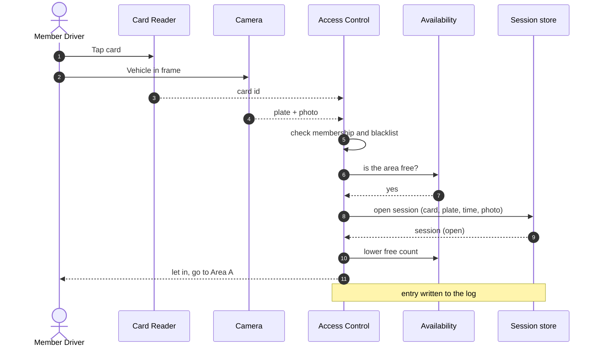
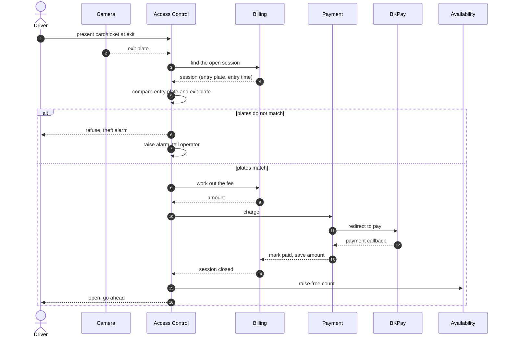
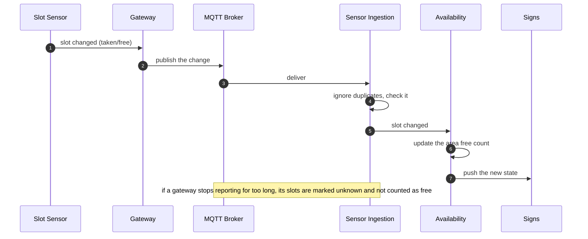
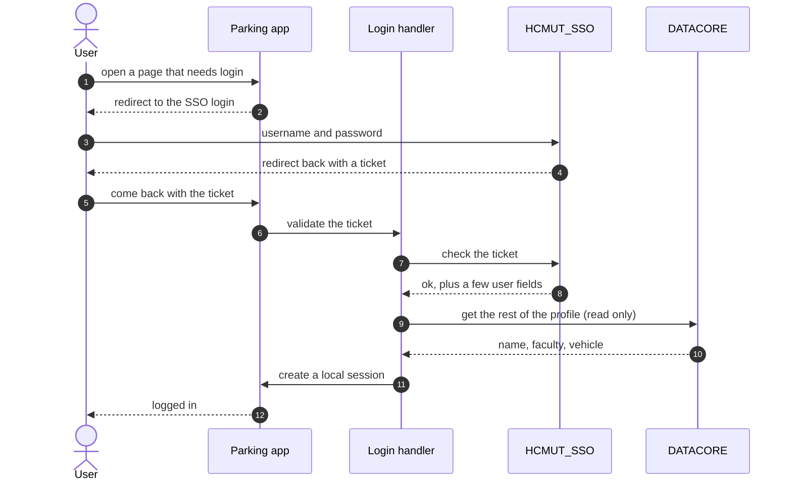
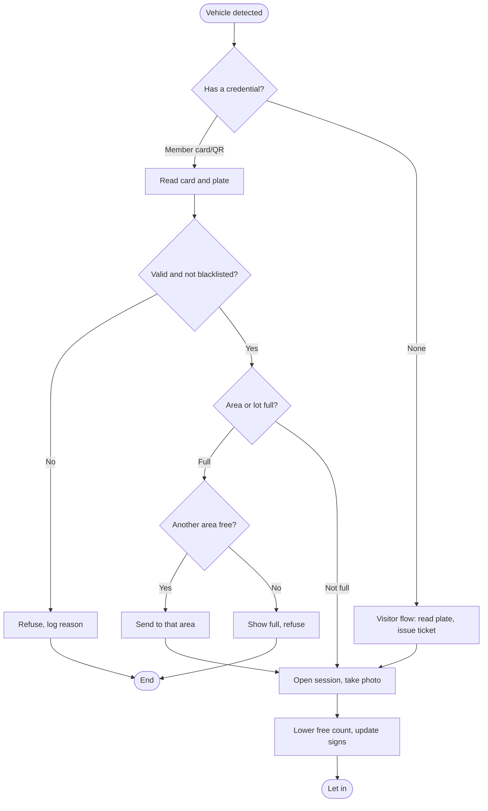
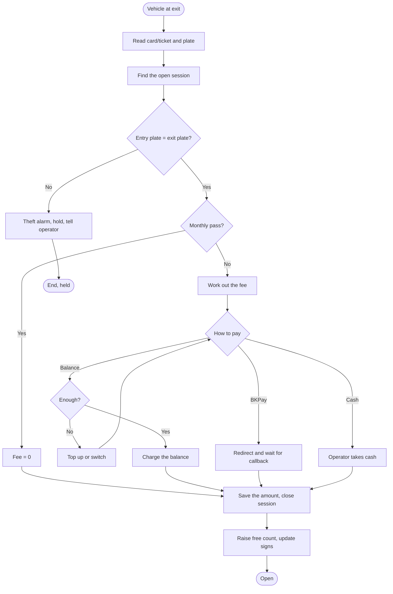
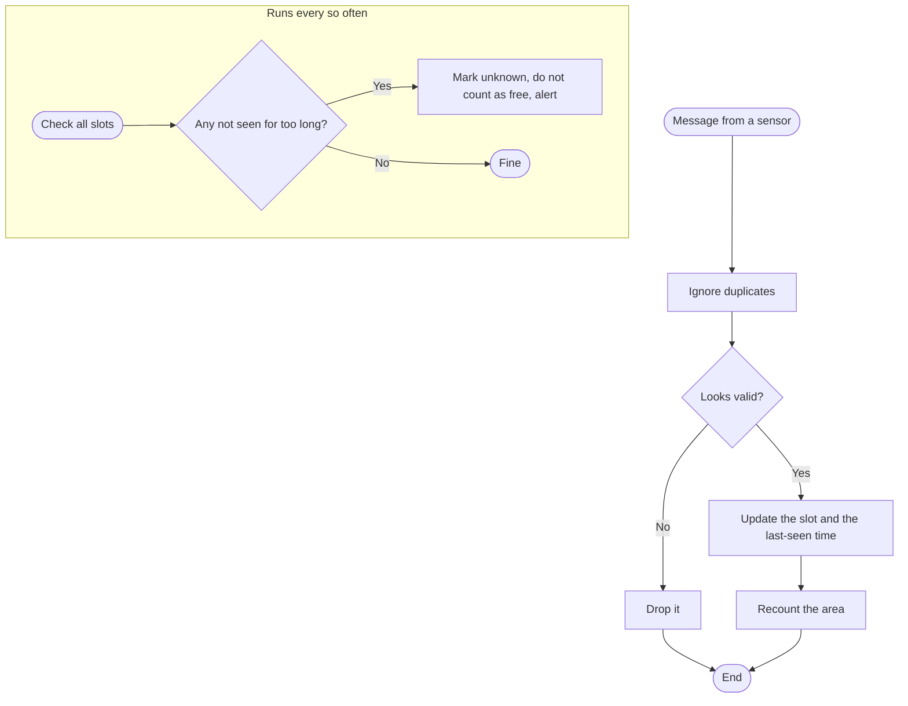
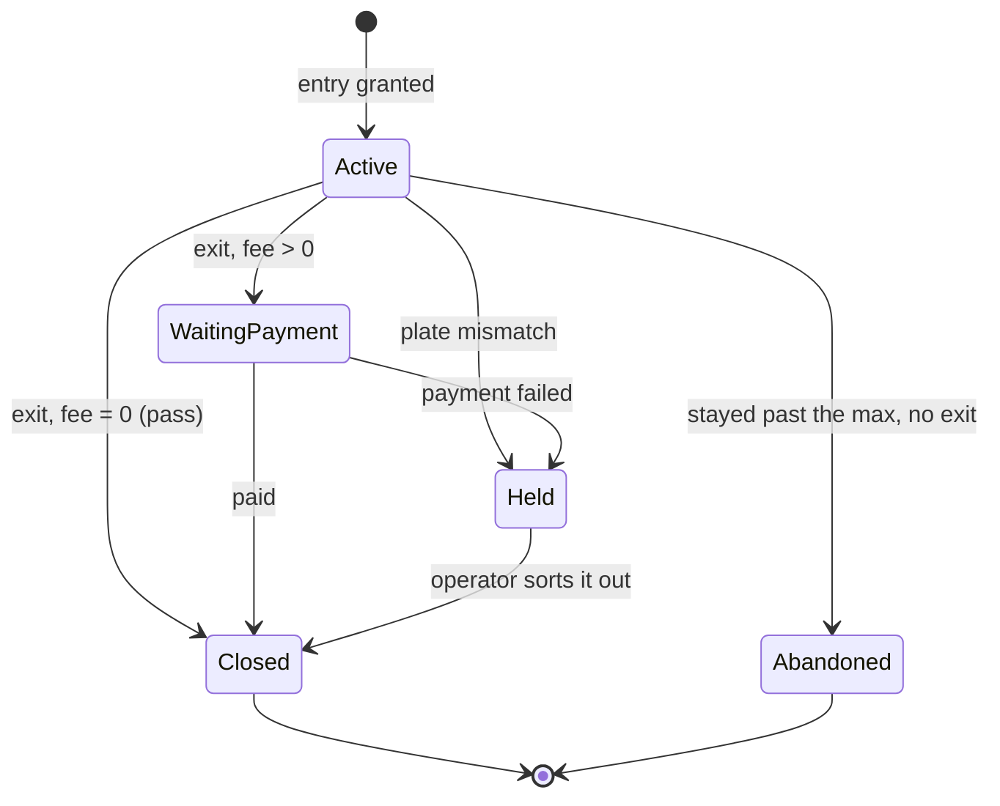
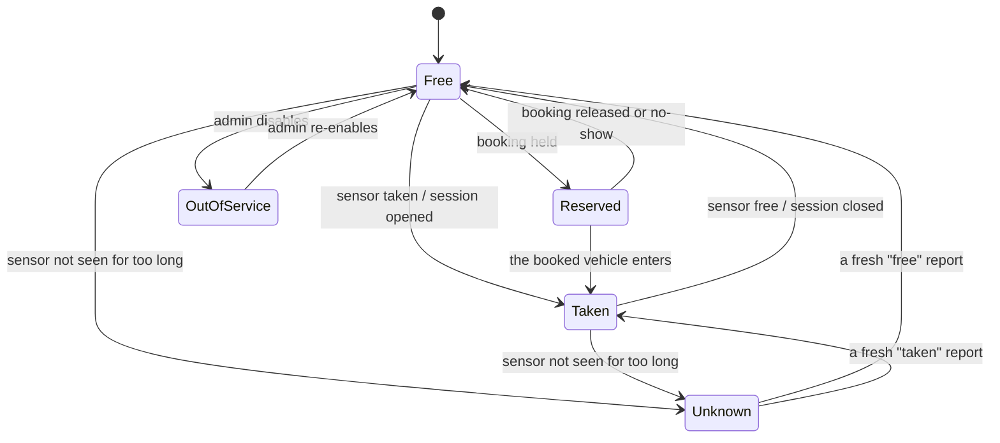
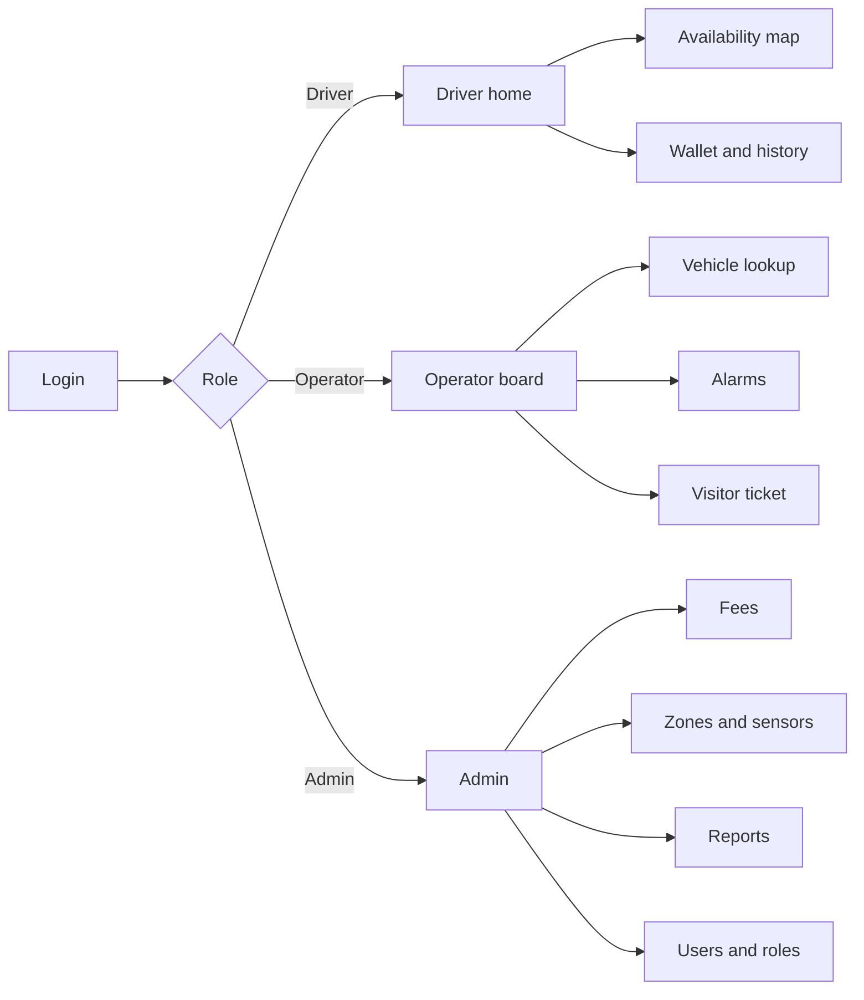

# Smart Parking Management System for HCMUT (IoT-SPMS)
## Submission #2: Use-case scenarios, diagrams, and UI

Course: Software Engineering (SE252)
This builds on the requirements in Submission #1.

## Contents
1. Use-case scenarios
2. Sequence diagrams
3. Activity diagrams
4. State diagrams
5. UI design

## 1. Use-case scenarios

We wrote out the main flows for the use cases in the diagram. The IDs (FR-...) point back to the requirements in Submission #1.

### UC-02: Member enters (motorbike lane)

Actors: member driver, plus the camera, card reader, and slot sensor.
Precondition: the member has an account and a registered card/plate, and the entry lane is working.
Trigger: a vehicle shows up at the entry lane.
Result on success: an open session with the entry time, lane, card, plate, and a photo; the free count for that area goes down by one; the entry is logged.

Main flow:
1. The vehicle arrives and the system starts reading the credential.
2. The reader reads the card, the camera reads the plate and takes a photo.
3. The system checks the card against membership and the blacklist.
4. It checks the target area is not full.
5. It opens a session and logs the entry as granted.
6. It lowers the free count and updates the signs.
7. For the car lane it opens the barrier.

What can go wrong:
- Card invalid or blacklisted: refuse, log the reason, show it, stop.
- Area full: send the driver to another area; if the whole lot is full, show full and refuse.
- No card at all: switch to the visitor flow (UC-02b).
- Plate does not match the member's registered plate: let them in but flag it, so we can check at exit.
- Network down: the gate decides from its local cache and queues the event to sync later.

### UC-02b: Visitor enters

Actors: visitor driver, operator, camera.
Precondition: the visitor has no account and there is room for visitors.
Trigger: no member card at the lane, or a member without their card asks to get in.
Result: a plate-only session is open and a QR ticket is issued.

Main flow:
1. The system (or the operator) sees there is no valid member card.
2. The camera reads and stores the plate, and a photo is taken.
3. A QR ticket is issued and a plate-only session opens, not tied to the SSO.
4. The entry is logged and the free count goes down.

If the plate cannot be read, the operator types it in. If there is no room for visitors, refuse and say so.

### UC-03: Exit and pay

Actors: member or visitor driver, camera, card reader, BKPay, barrier, and the operator for problems.
Precondition: there is an open session for the vehicle.
Trigger: the vehicle is at the exit lane.
Result on success: the session is closed, a paid record exists, the free count goes up, and the exit is logged.

Main flow:
1. The system reads the card or ticket and reads the plate again.
2. It finds the open session.
3. It compares the exit plate with the entry plate.
4. It works out the fee from the time and the price rule.
5. It charges the balance, sends the driver to BKPay, or the operator takes cash.
6. When paid, it saves the amount on the record and closes the session.
7. It raises the free count and updates the signs.
8. For the car lane it opens the barrier.

What can go wrong:
- The plates do not match: raise a theft alarm, hold the session, tell the operator (UC-08), keep the barrier shut until it is sorted.
- No open session found (lost ticket): the operator opens a lost-ticket case, charges a lost-ticket fee, and closes it by hand.
- Not enough balance: offer a top-up, BKPay, or cash.
- The BKPay callback never arrives: the session stays waiting for payment and the daily check (FR-ADM-06) catches it, or the operator confirms it if there is proof.
- Member on a monthly pass: the fee is zero, so skip payment and close the session.

### UC-08: Watch the lot and handle alarms

Actor: operator, logged in for their lot.
Trigger: an alarm comes up, or the operator opens the board.
Result: the alarm is dealt with and the action is logged.

Main flow:
1. The operator looks at the live board (occupancy, open sessions, alarms).
2. An alarm shows up (plate mismatch, stuck barrier, faulty sensor, or a double entry).
3. The operator looks at the related session or vehicle (find by plate, FR-AUD-02).
4. The operator acts (open by hand, hold, mark resolved).
5. The system logs what they did.

### UC-12: Configure fees, zones, devices (admin)

Actor: admin.
Result: the new setting is active and the change is logged.

Main flow:
1. The admin opens the configuration.
2. They edit a price rule and give it a start and end date.
3. The system checks there is no overlap with another active rule for the same type.
4. It saves and activates the change and logs it.

If the new rule overlaps an existing one, reject it and explain why.

## 2. Sequence diagrams

### SD-1: Member entry



### SD-2: Exit and pay, with the plate check



### SD-3: Sensor change to sign



### SD-4: Login through HCMUT_SSO



## 3. Activity diagrams

### AD-1: Entry decision



### AD-2: Exit and payment



### AD-3: Handling a sensor update



## 4. State diagrams

### ST-1: A parking session



### ST-2: A slot



## 5. UI design

The prototype in the `mvp` folder has these screens. Below are rough sketches of the layout and a map of how the screens connect.

### Screen map



### Driver: availability map

```
+------------------------------------------------------------------+
|  IoT-SPMS   Campus: Ly Thuong Kiet          Nguyen V.A   45k      |
+------------------------------------------------------------------+
|  Area A   green    112 / 150 free                                |
|  Area B   yellow    28 / 120 free    try Area A                  |
|  Area C   full       0 / 100         nearest free: Area A        |
|------------------------------------------------------------------|
|   A    [][][]XX[][][][][]    [] free  XX taken  ?? unknown        |
|   B    XXXXXX[][]X?                                              |
|   C    XXXXXXXXXX                                               |
|------------------------------------------------------------------|
|  Updated 2s ago            [Reserve]   [Directions]              |
+------------------------------------------------------------------+
```

The area bar is colored by its state, the grid shows each slot, and there is a legend that includes "unknown" so a stale sensor is not mistaken for a free slot.

### Entrance sign

```
        +----------------------------------+
        |      LY THUONG KIET PARKING      |
        |                                  |
        |          140  SPACES             |
        |                                  |
        |      Area A ->    Area B ->      |
        +----------------------------------+
```

It turns to "nearly full" at 90% and "full" at 100%.

### Operator board

```
+------------------------------------------------------------------+
|  OPERATOR   Lot: LTK-Main        2 alarms          [logout]      |
+------------------------------------------------------------------+
|  A  75%    B  100%    C  40%                                     |
|------------------------------------------------------------------|
|  ALARMS                                                          |
|   12:41  PLATE MISMATCH  session 8842  59-P1 234.56  [Inspect]  |
|   12:38  SENSOR FAULT    slot B-07             [Ack] [Dispatch]  |
|------------------------------------------------------------------|
|  Find vehicle by plate: [ 59-____.__ ]  [Search]                |
|  Open sessions: 1,204     Visitors in lot: 37                   |
|  [ Issue visitor ticket ]   [ Manual open ]                     |
+------------------------------------------------------------------+
```

### Exit terminal

```
+---------------------------------------------+
|            EXIT - Fee                       |
|---------------------------------------------|
|  Plate:  59-P1 234.56   matches entry       |
|  Entry:  07:12  Exit: 12:45  Stay: 5h33m    |
|  Vehicle: Motorbike   Student (-15%)        |
|  Fee:                  5,000 VND            |
|---------------------------------------------|
|  Pay with:  ( ) Balance 45,000 VND          |
|             ( ) BKPay                       |
|             ( ) Cash (operator)             |
|          [ Confirm and exit ]               |
+---------------------------------------------+
```

### Admin: fees

```
+------------------------------------------------------------------+
|  ADMIN - Price rules                            [+ New]          |
+------------------------------------------------------------------+
|  Name          Vehicle  Type     Rate       Free  Cap   From     |
|  Std MB        MB       all      3,000/day  30m   -     2024     |
|  Student MB    MB       student  -15%       30m   -     2024     |
|  Std Car       Car      all      5,000/2h   15m   50k   2024     |
|  Visitor       any      visitor  flat 8,000  -    -     2024     |
|------------------------------------------------------------------|
|  Sign thresholds:  green < [75] %   nearly full at [90] %        |
|                                          [ Save ]                |
+------------------------------------------------------------------+
```

A few things we kept in mind for the UI. The driver screen is kept simple; the operator board is denser because they need more on one screen. We show the last-updated time on each screen so stale data is not mistaken for live. The colors mean the same thing everywhere, and we added an "unknown" state so a broken sensor does not look like a free slot. The exit screen shows the plate-check result on purpose since that is the anti-theft part. And it is all built around motorbikes and Vietnamese plates because that is what it is here.
