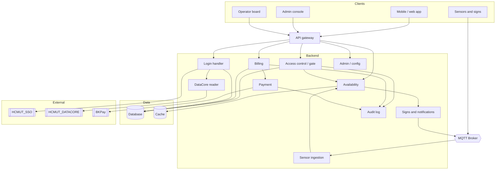
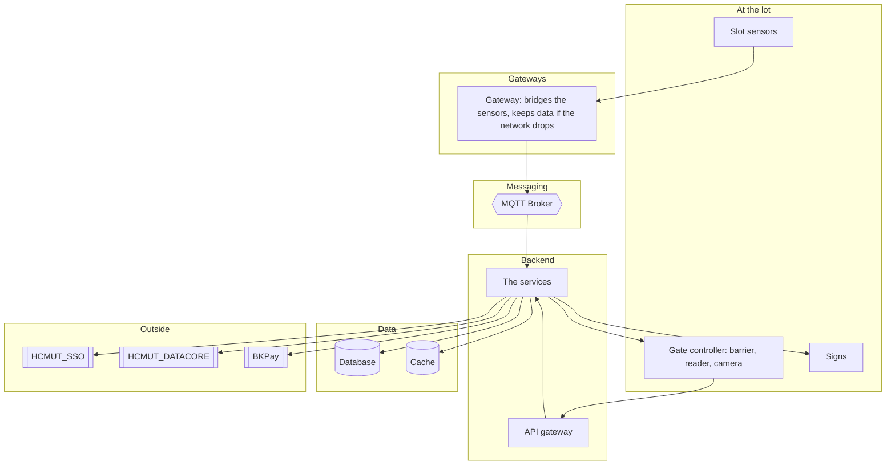
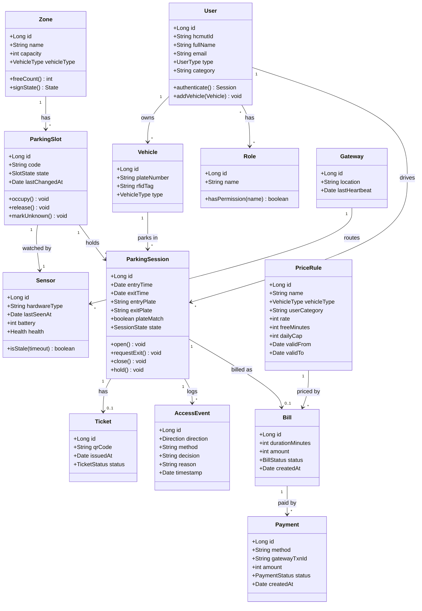
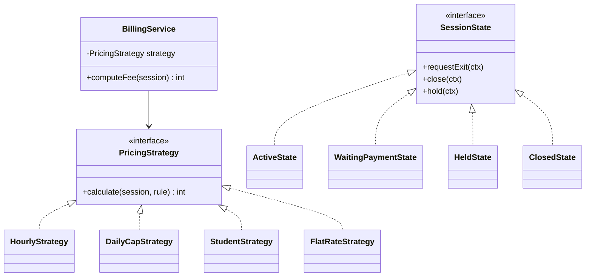

# Smart Parking Management System for HCMUT (IoT-SPMS)
## Submission #3: Design

Course: Software Engineering (SE252)
This builds on Submissions #1 and #2.

## Contents
1. Architecture overview
2. Components
3. Deployment
4. Class diagram
5. Design patterns
6. Class and method descriptions
7. Test cases

## 1. Architecture overview

We split the system into a few services, each responsible for one part of the job, and put an API gateway in front of them. For the project we build it as one application with these parts kept as separate modules, rather than as truly separate deployed services, so that a small team can actually build and run it. If the system grew, the same boundaries would let us pull a module out into its own service later. The two we would split first are the sensor ingestion and the payment part, because those are the ones most likely to be noisy or to fail in ways we do not control.

We grouped the modules by what they own and by how often they change, not just by which table they touch. The sensor and gate code changes when hardware changes, so we keep it apart. The pricing and payment code changes when the fees or the bank change, so that is apart too. The availability view is read a lot, so we keep its data separate and cache it.

Each of these choices lines up with a non-functional requirement from Submission #1:

- We put the sensors behind an MQTT broker so a slow or offline sensor does not block the rest (NFR-REL-03).
- The gate keeps a local cache and works offline (NFR-REL-02).
- Calls out to SSO, DATACORE, and BKPay have a timeout and a fallback, so if one of them is down the rest keeps going (NFR-REL-01).
- The free-count for the availability view is cached so reads are fast (NFR-PERF-02).
- We keep an audit table of who did what (NFR-SEC-03).
- We check the roles on every request and make sure a user can only see their own session (NFR-SEC-02).

## 2. Components

What each module does:

- API gateway: the single entry point. Handles HTTPS, routing, and checking the login token.
- Login handler: does the SSO login and creates a local session. Keeping this in one place means we can fake the login in testing.
- Access control (gate): decides entry and exit, matches the plate/card/QR to a session, and writes the entry/exit events.
- Sensor ingestion: the only module that writes slot state. It reads the MQTT messages, drops duplicates, and updates the slots.
- Availability: keeps the free-count per area, ready to read quickly, and feeds the signs and the app.
- Billing: works out the fee for a session and makes the bill when the session closes.
- Payment: talks to BKPay and records the payment.
- DataCore reader: pulls student and vehicle data and caches it. We only read from DATACORE.
- Admin / config: manages zones, slots, sensors, price rules, and the device list.
- Signs and notifications: sends updates to the signs and messages to users.
- Audit log: keeps a record of entries, exits, payments, and admin actions.

## 3. Deployment

Some notes:

- The sensors send their updates to a nearby gateway, which forwards them to the broker over the network. If the network to the backend drops, the gateway holds the data and sends it once it is back.
- The database holds the real data (sessions, bills, users, events). The cache holds the free-count for fast reads.
- All the links use HTTPS.

## 4. Class diagram

The classes fall into three kinds. The entity classes are the ones above (User, Vehicle, Zone, ParkingSlot, Sensor, Gateway, ParkingSession, Ticket, AccessEvent, PriceRule, Bill, Payment). The screen classes are the login page, availability map, operator board, exit terminal, and admin pages. The service classes are the ones from Section 2 (login handler, access control, sensor ingestion, availability, billing, payment, admin, notifications, audit), described in Section 6.

## 5. Design patterns

We used a few patterns where they fit:

- Observer, for the sensor updates. The sensor ingestion is the source of "a slot changed" events, and the availability, signs, and access-control code react to them. In the prototype this is just a small event bus, and over MQTT it is the same idea (publish and subscribe).
- State, for the session and the slot. Instead of a big if/else on a status field, the session moves between states (active, waiting for payment, held, closed) and only the allowed moves are possible. This is the same as the state diagrams in Submission #2.
- Strategy, for the pricing. There is one interface that takes a session and returns an amount, and a class per pricing style (per hour, per day with a cap, free grace period, student rate, flat rate). Adding a new fee style means adding a class, not editing the billing code.
- Adapter, for the outside systems. The SSO, DATACORE, and BKPay each sit behind a small adapter, so we can swap in a fake one for testing.

## 6. Class and method descriptions

The service classes and their main methods.

### LoginHandler
- buildLoginRedirect(serviceUrl): returns the SSO login URL to send the user to.
- validateTicket(ticket, serviceUrl): checks the ticket on our server and returns the user identity, or an error if it is invalid.
- createSession(identity): creates the local user on first login if needed, fills in the profile from DATACORE, and issues a local session token.
- logout(): ends the local session.

### AccessControlService
- handleEntry(read): checks the credential, the blacklist, and whether the area is free, opens a session, writes the entry event, and lowers the free count. Returns granted or denied with a reason.
- handleExit(read): finds the open session, checks the plate, triggers the fee and payment, and closes the session on success.
- verifyPlateMatch(session, exitPlate): compares the exit plate with the entry plate. If they differ it raises the theft alarm, holds the session, and returns false.
- startVisitorSession(plate): opens a plate-only session and gives out a QR ticket.
- openBarrier(gate): sends the open command to the barrier, with the safety check so it does not close on someone.

### SensorIngestionService
- onMessage(msg): the entry point for a sensor message. Drops duplicates, checks it, and applies it.
- applyChange(slotId, state, time): updates the slot and its last-seen time, and fires a "slot changed" event.
- checkStale(): runs every so often; any slot not seen for too long is marked unknown, not counted as free, and an alert is raised.
- reconcile(zone): compares the sensor counts with the gate counts and flags differences.

### AvailabilityService
- onSlotChanged(event): updates the free count for the area.
- freeCount(zoneId): returns the current free count for an area, not counting unknown or out-of-service slots.
- signState(zoneId): turns the occupancy percentage into a sign state using the admin thresholds.
- nearestFreeZone(fromZoneId): returns the nearest area that still has room, for the guidance arrows.

### BillingService
- resolveRule(session): picks the price rule for the vehicle type and user category for the time of the session.
- computeFee(session): uses the chosen pricing strategy to work out the amount.
- closeSession(session): saves the amount on a new bill and moves the session toward closed. The amount is saved so a later price change does not affect this bill.
- generateStatement(user, period): adds up a member's bills over a period and sends the payment request to BKPay.

### PaymentService
- initiate(bill, method): creates a pending payment with its own reference id and builds the redirect to BKPay.
- handleCallback(callback): checks the callback, matches it to the payment and amount, and marks it paid. If the same callback comes twice, it does not charge twice.
- refund(payment, amount): issues a refund and records it.

### AdminService, NotificationService, AuditService
- upsertPriceRule(rule): checks there is no overlapping active rule, saves it with its dates, and logs the change.
- assignRole(user, role): grants or removes a role and logs it.
- pushSign(zone, state): sends the sign state to the signs.
- append(actor, action): writes a row to the audit log with who did it and when.
- reconcile(day): matches the payments we recorded against the bank report and flags any that do not match.

## 7. Test cases

Some tests across the main flows, including the ones that can go wrong.

| ID | Requirement | Setup | Steps | Expected |
|---|---|---|---|---|
| TC-01 | FR-ENT-04 | Valid member, area not full | Card and plate at entry | Session opened, free count down one, granted logged |
| TC-02 | FR-ENT-06 | Area full, no other free | Card at entry | Refused, sign shows full, reason logged |
| TC-03 | FR-ENT-05 | No card | Vehicle at lane | Plate-only session and QR ticket issued |
| TC-04 | FR-EXT-03 | Student, motorbike, ~5h33m stay | Exit and compute | Fee applies the student discount and the cap correctly |
| TC-05 | FR-EXT-04 | Entry plate differs from exit plate | Card at exit | Theft alarm, session held, barrier stays shut, operator told |
| TC-06 | FR-EXT-06 | Session closes, then price changes | Close, then change the rule | Old bill unchanged (amount was saved) |
| TC-07 | FR-OCC-05 | Sensor silent too long | Wait past the timeout | Slot goes to unknown, alert raised, not counted as free |
| TC-08 | FR-SIG-01 | Occupancy passes 90% | Fill the area | Sign turns to nearly full |
| TC-09 | FR-EXT-05 | Payment callback arrives twice | Send it twice | Charged once only |
| TC-10 | FR-ADM-06 | A recorded payment with no bank line | Run the daily check | Flagged as not matching |
| TC-11 | NFR-REL-02 | Backend offline | Enter during the outage | Gate decides locally, event syncs when back |
| TC-12 | NFR-SEC-02 | User asks for another user's session | Request a session they do not own | Refused |
| TC-13 | NFR-SAFE-01 | Vehicle under the barrier | Command close | Barrier does not close |
