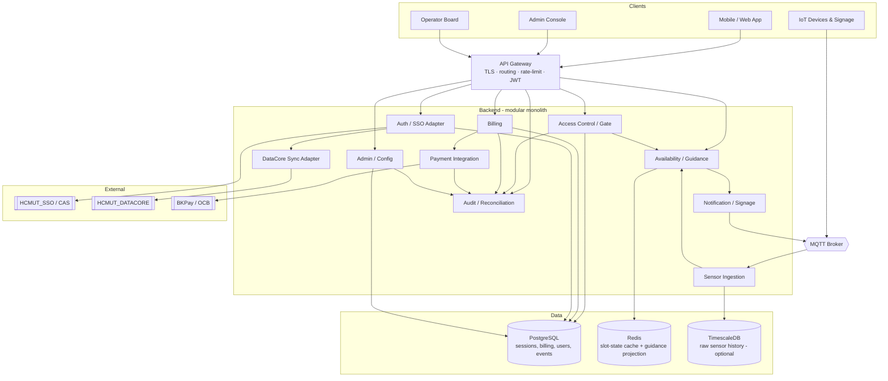
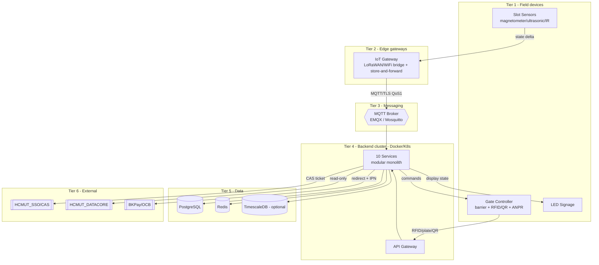
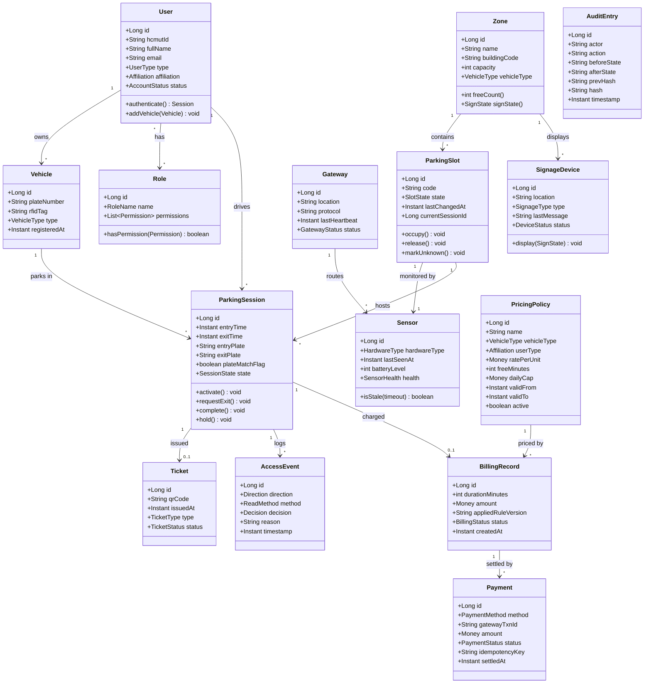
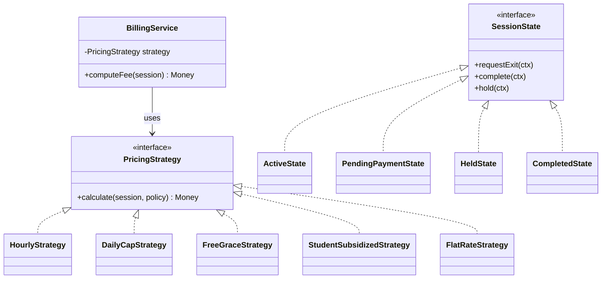

# IoT-based Smart Parking Management System (IoT-SPMS)
## Submission #3 — Architectural & Detailed Design

**Course:** Software Engineering (SE252)
**Project:** Smart Parking System for University Campus — HCMUT
**Document status:** v1.0 (builds on Submissions #1 and #2)

---

## Table of Contents
1. [Architectural Overview](#1-architectural-overview)
2. [Development / Implementation View (Components)](#2-development--implementation-view-components)
3. [Deployment View](#3-deployment-view)
4. [Domain Class Diagram](#4-domain-class-diagram)
5. [Design Patterns Applied](#5-design-patterns-applied)
6. [Class & Method Descriptions](#6-class--method-descriptions)
7. [Test Cases](#7-test-cases-bonus)

---

## 1. Architectural Overview

### 1.1 Architectural style
The system adopts a **layered, event-driven, service-oriented architecture** deployed as a **modular monolith** for the MVP (ten logical services as internal modules behind one API gateway, one MQTT broker, one PostgreSQL database). This preserves clean service boundaries and the story of a future microservice split, while remaining buildable and demonstrable by a student team. Only the **Sensor Ingestion** and **Payment** modules are candidates for a first physical split, because they own the two hardest failure surfaces (noisy IoT traffic; slow/flaky external gateway).

Rationale for the decomposition: services are split by **rate-of-change** and **data ownership**, not by CRUD entity. Hardware protocols churn (→ isolate in Ingestion and Gate); money rules and gateways change independently (→ isolate in Billing and Payment); read-heavy availability scales separately from writes (→ CQRS-lite Availability projection).

### 1.2 Quality-driven decisions (traceable to NFRs)
| Decision | Serves NFR |
|---|---|
| MQTT broker as the single IoT↔backend seam with retained messages + QoS1 | NFR-PERF-02, NFR-REL-03 |
| Edge/gateway store-and-forward + offline gate decisions | NFR-REL-02 |
| Circuit Breaker + fallback on every external call (SSO/DATACORE/BKPay) | NFR-REL-01, NFR-COMP-01 |
| CQRS-lite Availability read projection in Redis | NFR-PERF-02, NFR-SCAL-01 |
| Hash-chained, append-only audit log | NFR-SEC-03 |
| Idempotent IPN handler + daily reconciliation | NFR-SEC-04, FR-ADM-06 |
| RBAC gate + object-level ABAC middleware | NFR-SEC-02 |

---

## 2. Development / Implementation View (Components)



**Module responsibilities**

| # | Module | Responsibility | Owns |
|---|---|---|---|
| 1 | **API Gateway** | Single ingress; TLS, routing, rate-limit, JWT validation, CORS. | — |
| 2 | **Auth / SSO Adapter** | CAS login dance; mints internal JWT; maps SSO identity → local User/Role. | session/token |
| 3 | **Access Control / Gate** | Entry/exit decisions; plate/RFID/QR match; barrier commands; writes AccessEvent. | AccessEvent |
| 4 | **Sensor Ingestion** | Only MQTT consumer that writes slot state; validate/dedupe/debounce; emit SlotStateChanged. | Slot/Sensor state |
| 5 | **Availability / Guidance** | Read-optimized free-count projection per Zone; nearest-free routing; feeds signage/app. | availability projection |
| 6 | **Billing** | ParkingSession pricing lifecycle; applies PricingPolicy; produces BillingRecord. | Session, BillingRecord |
| 7 | **Payment Integration** | BKPay adapter (redirect + IPN); idempotency + retries; reconciles Payment vs BillingRecord. | Payment |
| 8 | **DataCore Sync Adapter** | Read-only pull of identity/vehicle data; local cache with TTL. | user cache |
| 9 | **Admin / Config** | Zones, slots, sensors, pricing policies, device registry, feature flags. | config |
| 10 | **Notification / Signage** | Fan-out to LED signage, mobile push, SMS/email. | delivery |
| — | **Audit / Reconciliation** | Hash-chained audit log; daily settlement reconciliation. | audit log |

---

## 3. Deployment View

Six tiers, bottom-up. Device↔broker and service↔external links use mutual TLS where possible.



**Node notes**
- Backend services are stateless & horizontally scalable, **except Sensor Ingestion** which is partitioned by gateway/zone (ordering matters per slot).
- Redis holds the slot-state cache and the guidance projection (CQRS read side); PostgreSQL is the transactional write model.
- Gateways buffer messages during backhaul outages and replay in order on reconnect (store-and-forward), satisfying NFR-REL-02.

---

## 4. Domain Class Diagram



**Class stereotypes (for grading clarity):**
- **Entity:** User, Role, Vehicle, Zone, ParkingSlot, Sensor, Gateway, ParkingSession, Ticket, AccessEvent, PricingPolicy, BillingRecord, Payment, SignageDevice, AuditEntry.
- **Boundary/View:** LoginView, AvailabilityMapView, OperatorBoardView, ExitTerminalView, AdminTariffView.
- **Control/Service:** AuthService, AccessControlService, SensorIngestionService, AvailabilityService, BillingService, PaymentService, AdminService, NotificationService, AuditService (see §6).

---

## 5. Design Patterns Applied

| Pattern | Where | Why |
|---|---|---|
| **Observer** | `SensorIngestion` (Subject) → `Availability`, `Notification`, `AccessControl` (Observers) via `SlotStateChangedEvent` | Decouples "who knows a slot freed" from "who reacts"; implemented as MQTT fan-out + in-app event bus. |
| **State** | `ParkingSession` and `ParkingSlot` lifecycles as State classes | Legal transitions only; prevents "paid before exit" bugs; testable state machine (see ST-1/ST-2 in Submission #2). |
| **Strategy** | `PricingStrategy` implementations: `HourlyStrategy`, `DailyCapStrategy`, `FreeGraceStrategy`, `StudentSubsidizedStrategy`, `FlatRateStrategy` | New rate schemes = new class, no edit to Billing core. |
| **Adapter** | `SsoAdapter`, `DataCoreAdapter`, `PaymentGatewayAdapter`→`BkPayAdapter` | Clean internal port; swap BKPay / mock SSO in tests without touching domain. |
| **Circuit Breaker** | Wrap outbound SSO/DATACORE/BKPay calls (+ bulkhead, timeout, retry-with-backoff) | Documented fallback per external system → "what happens when BKPay is down" has an answer. |
| **Repository** | One per aggregate (`SessionRepository`, `SlotRepository`, …) | Isolates persistence from domain logic. |
| **CQRS-lite** | Availability reads a denormalized Redis projection separate from the Postgres write model | Read scaling without touching writes (NFR-SCAL-01). |



---

## 6. Class & Method Descriptions

Every method in the design carries a description of purpose, parameters, return, and key behaviour/exceptions. (Control/service classes shown; entity getters/setters omitted for brevity.)

### 6.1 `AuthService`  *(control — Auth/SSO Adapter)*
| Method | Description |
|---|---|
| `String buildLoginRedirect(String serviceUrl)` | Returns the CAS login redirect URL (`/cas/login?service=…`) for an unauthenticated request. `serviceUrl` must byte-match the later validation call. |
| `AuthResult validateTicket(String serviceTicket, String serviceUrl)` | Server-to-server call to `/p3/serviceValidate`; on `authenticationSuccess` extracts uid + attributes and returns the identity. Throws `TicketValidationException` on failure/replay. |
| `Session mintSession(AuthResult r)` | JIT-provisions a local `User` if new, enriches from DataCore, and issues a signed JWT/local session. |
| `void logout(String sessionIndex)` | Handles CAS single-logout (fire-and-forget): maps SessionIndex → local session and invalidates it. |

### 6.2 `AccessControlService`  *(control — Gate)*
| Method | Description |
|---|---|
| `AccessDecision handleEntry(GateRead read)` | Validates credential + blacklist + zone availability; creates an ACTIVE `ParkingSession`; writes `AccessEvent(GRANTED)`; decrements free-count. Returns GRANTED/DENIED + reason. |
| `AccessDecision handleExit(GateRead read)` | Finds the active session; calls `verifyPlateMatch`; triggers billing/payment; on success completes the session and increments free-count. |
| `boolean verifyPlateMatch(ParkingSession s, String exitPlate)` | Compares entry vs exit plate; on mismatch raises `PLATE_MISMATCH` alarm, holds the session, and returns false (FR-EXT-04). |
| `Ticket startVisitorSession(String plate)` | Opens a plate-only session and issues a QR ticket for the visitor/temporary-access flow (FR-ENT-05). |
| `void commandBarrier(GateId g, BarrierAction a)` | Sends open/close to the barrier controller with the fail-safe interlock (NFR-SAFE-01). |

### 6.3 `SensorIngestionService`  *(control — the only slot-state writer)*
| Method | Description |
|---|---|
| `void onMessage(MqttMessage m)` | Entry point for every MQTT slot message: debounce, dedupe, validate, then apply. Drops invalid payloads and increments an error metric. |
| `void applyStateChange(Long slotId, SlotState s, Instant ts)` | Updates authoritative slot state + `lastSeenAt`; publishes a `SlotStateChangedEvent` (Observer subject). |
| `void runStalenessWatchdog()` | Periodic job: any slot older than the staleness timeout → `markUnknown()` + alert; never counts unknown as free (FR-OCC-05). |
| `void reconcile(Zone z)` | Periodically compares sensor-derived state vs gate entry/exit counts and flags discrepancies (FR-OCC-04). |

### 6.4 `AvailabilityService`  *(control — read projection / Observer)*
| Method | Description |
|---|---|
| `void onSlotStateChanged(SlotStateChangedEvent e)` | Applies the delta to the per-zone free-count in the Redis projection. |
| `int freeCount(Long zoneId)` | Returns the current free count for a zone (excludes UNKNOWN/OUT_OF_SERVICE). |
| `SignState signState(Long zoneId)` | Maps occupancy % to a sign state using the admin-configured thresholds (FR-SIG-01/04). |
| `Zone nearestFreeZone(Long fromZoneId)` | Returns the nearest non-full zone for directional guidance (FR-SIG-03). |

### 6.5 `BillingService`  *(control)*
| Method | Description |
|---|---|
| `PricingPolicy resolvePolicy(ParkingSession s)` | Selects the active `PricingPolicy` for the session's vehicle type + affiliation at the session's time (temporal lookup). |
| `Money computeFee(ParkingSession s)` | Uses the chosen `PricingStrategy` to compute the fee (duration, free minutes, daily cap, rounding). |
| `BillingRecord closeSession(ParkingSession s)` | **Freezes** amount + rule version onto a new `BillingRecord`; transitions the session toward COMPLETED (FR-EXT-06). |
| `Statement generatePeriodStatement(User u, Period p)` | Aggregates charge lines over a billing period into a statement and initiates a BKPay request (FR-EXT-08). |

### 6.6 `PaymentService`  *(control — Payment Integration)*
| Method | Description |
|---|---|
| `PaymentRequest initiate(BillingRecord b, PaymentMethod m)` | Creates a PENDING `Payment` with its own order/reference id (the correlation key); builds the signed redirect request. |
| `void handleIpn(IpnCallback cb)` | Verifies HMAC first; checks the transaction + amount; conditional update `PENDING→SETTLED WHERE status='PENDING'` (idempotent); rejects stale/replayed callbacks. |
| `boolean isDuplicate(String eventId)` | Short-circuits already-processed callbacks (idempotency store). |
| `void refund(Payment p, Money amount)` | Issues a refund and records an audit + reconciliation entry. |

### 6.7 `AdminService` / `NotificationService` / `AuditService`
| Method | Description |
|---|---|
| `PricingPolicy upsertPolicy(PolicyDraft d)` | Validates non-overlapping active rules; versions with `validFrom/validTo`; audits the change (FR-ADM-01). |
| `void assignRole(User u, Role r)` | Grants/revokes roles (data-driven RBAC) with audit (FR-ADM-02). |
| `void pushSignage(Zone z, SignState s)` | `NotificationService`: fans out the sign state to signage devices (FR-SIG-02/03). |
| `AuditEntry append(String actor, String action, Object before, Object after)` | `AuditService`: writes a hash-chained, append-only audit row `hash = H(prevHash + rowData)` (NFR-SEC-03). |
| `List<ReconBreak> reconcile(Date day)` | Matches local settled payments against the bank settlement file; records unmatched items as reconciliation breaks (FR-ADM-06). |

---

## 7. Test Cases *(bonus)*

Representative cases spanning the highest-risk flows (happy path + the failure/edge flows where rubric points live).

| TC-ID | Requirement | Precondition | Steps | Expected result |
|---|---|---|---|---|
| TC-01 | FR-ENT-04 | Valid member, zone not full | Present card + plate at entry | ACTIVE session created; free-count −1; GRANTED logged |
| TC-02 | FR-ENT-06 | Zone full, no alternative | Present card at entry | Entry DENIED; sign shows FULL; DENIED reason logged |
| TC-03 | FR-ENT-05 | No credential | Vehicle at lane | Visitor plate-only session + QR ticket issued |
| TC-04 | FR-EXT-03 | Student, motorbike, 5h33m stay | Exit & compute | Fee applies student −15% + daily-cap + rounding correctly |
| TC-05 | FR-EXT-04 | Entry plate ≠ exit plate | Present card at exit | Anti-theft alarm raised; session HELD; barrier blocked; operator notified |
| TC-06 | FR-EXT-06 | Session closing; rate later changes | Close then change tariff | Historical bill unchanged (amount + rule version frozen) |
| TC-07 | FR-OCC-05 | Sensor silent > staleness timeout | Wait past timeout | Slot → UNKNOWN; alert ≤30s; not counted as free |
| TC-08 | FR-SIG-01/04 | Occupancy crosses 90% | Fill zone to 90% | Sign state → ORANGE "NEARLY FULL" |
| TC-09 | Payment idempotency | IPN delivered twice | Send duplicate IPN | Second IPN is a no-op; single SETTLED payment |
| TC-10 | FR-ADM-06 | Local SETTLED, no settlement line | Run reconciliation | Item flagged as reconciliation break |
| TC-11 | NFR-REL-02 | Backend offline | Entry during outage | Local decision cached; event synced ≤60s on reconnect |
| TC-12 | NFR-SEC-02 | end_user calls another user's session | `GET /sessions/{id}` not owned | 403 Forbidden (object-level ABAC) |
| TC-13 | FR-AUD-04 | Any privileged action | Admin changes a tariff | Hash-chained audit row written; chain verifies |
| TC-14 | NFR-SAFE-01 | Vehicle under barrier | Command close | Barrier does not close; hazard warning |
```
